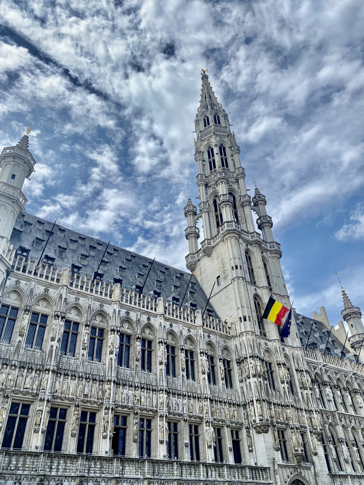
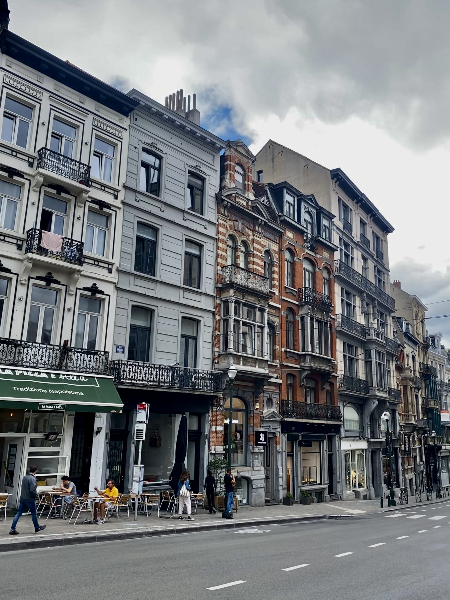
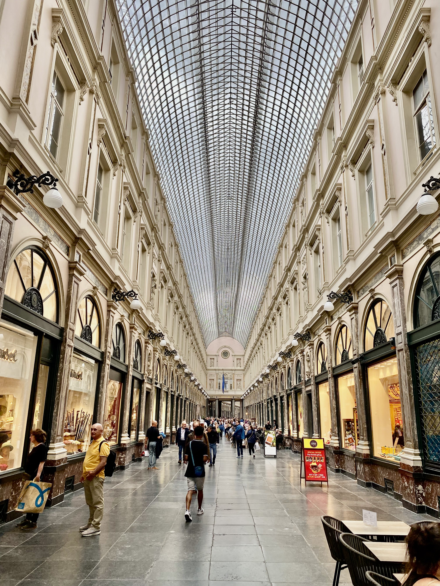

Brussels is the capital city of Belgium, and is located in central Belgium. It is known for its historic landmarks and cultural institutions, as well as its role as the seat of the European Union. The city is known for its chocolate, waffles, and beer, and is often referred to as the "Capital of Europe".

### What to do
- Visit the Atomium, a modernist steel structure that was built for the 1958 World's Fair.
- Explore the Grand Place, a UNESCO World Heritage Site and the central square of Brussels, which is surrounded by historic guildhalls and the city's Town Hall.
- Take a tour of the European Union institutions, including the European Commission and the European Parliament.
Visit the Manneken Pis, a iconic bronze statue of a urinating boy that has become a symbol of the city.
- Try some of the local cuisine, including Belgian waffles, chocolate, and beer. There are many restaurants and cafes throughout the city that serve these dishes.

### What to eat
- Belgian waffles: These are a popular street food in Brussels, and are made with a thick, fluffy batter that is cooked in a waffle iron. They are often served with whipped cream and fruit.
- Belgian chocolate: Belgium is known for its high-quality chocolate, and there are many chocolate shops throughout Brussels where you can try a variety of different chocolates.
- Moules-frites: This is a traditional Belgian dish that consists of mussels and fries. The mussels are usually served in a broth made with white wine and shallots.
- Stoemp: This is a traditional Belgian dish made with mashed potatoes and vegetables, such as carrots, Brussels sprouts, or turnips. It is often served as a side dish.
- Belgian beer: Belgium is home to a wide variety of beers, including lambics, saisons, and abbey beers. There are many bars and breweries in Brussels where you can try different types of Belgian beer.

