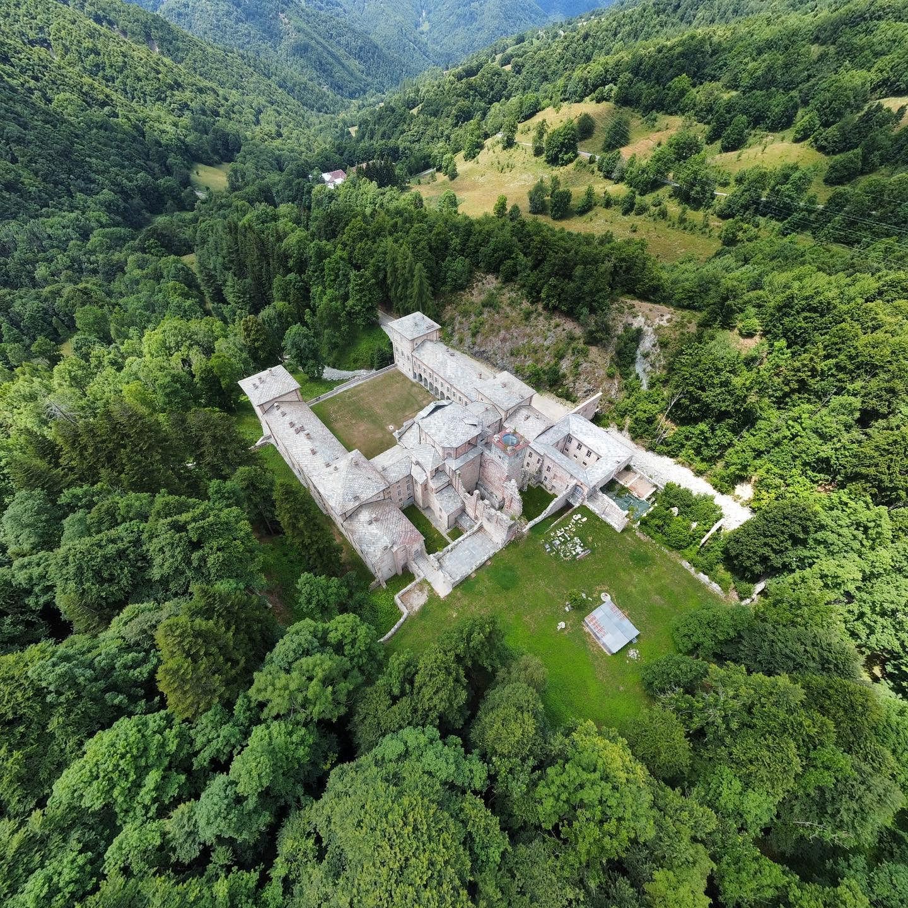
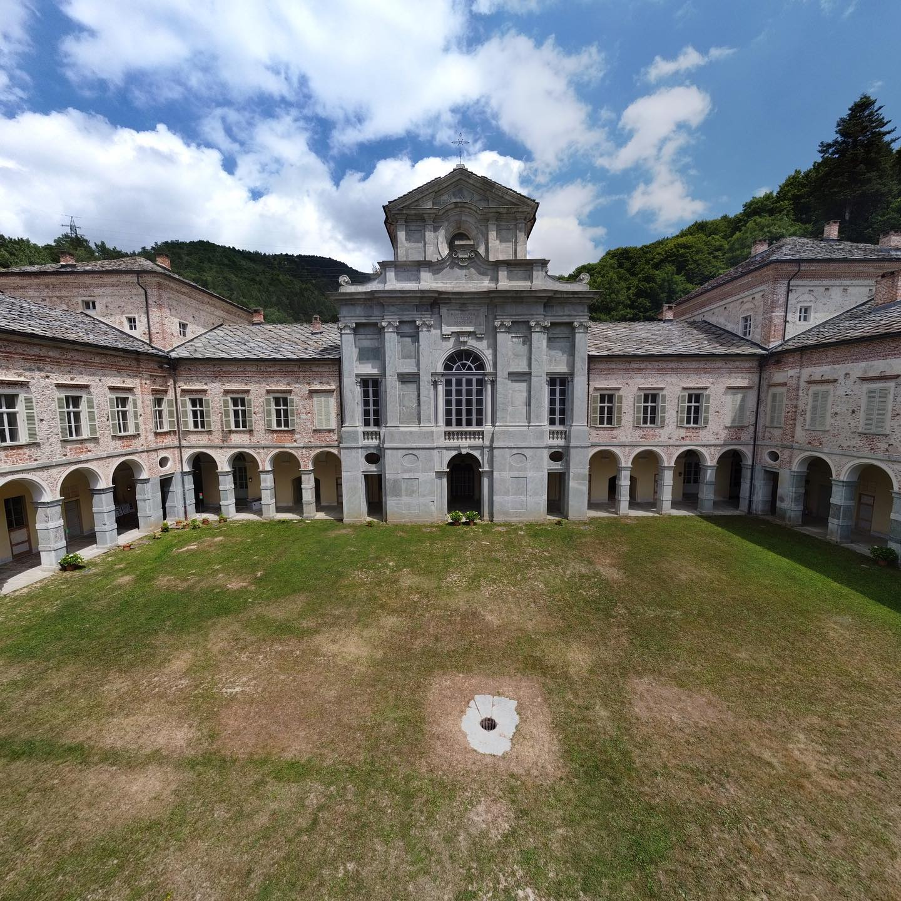

The Valcasotto valley protects its gem: A huge white palace, built in 1100 and surrounded by green mountains.

<!--truncate-->

### The History

The Valcasotto palace served different purposes during its long history. It was initially built as a religious monastery for the Carthusians, a Roman Catholic religious order of monks known for their way of life which emphasizes solitude, prayer, and manual labor. After more than 700 years, it was purchased by the royal family, the Savoy. It was transformed into a hunting residence and it was one of the favorite places of Vittorio Emanuele II, the first Italian king. More recently, the Valcasotto palace was acquired by the Piedmont region and it has been opened to the public.

### How to visit it

The best way to reach the [Valcasotto palace location](https://goo.gl/maps/gs2JTXCthkbqRPSy7) is by car, a 30-minute drive from the closest town of Garessio along a small mountain paved road. The entrance to the main area is free, and a 10 euro ticket is required to visit the inside. The palace is often closed, so it is advisable to check the opening hours on [its official website](https://www.comune.garessio.cn.it/en-us/vivere-il-comune/cosa-vedere/castello-di-casotto-sec-xii-17706-1-d1ce67833a3f32c7f08cd5dbdefa59a1) before visiting. There is a small bar and restaurant located next to the entrance, which serves delicious sandwiches.

