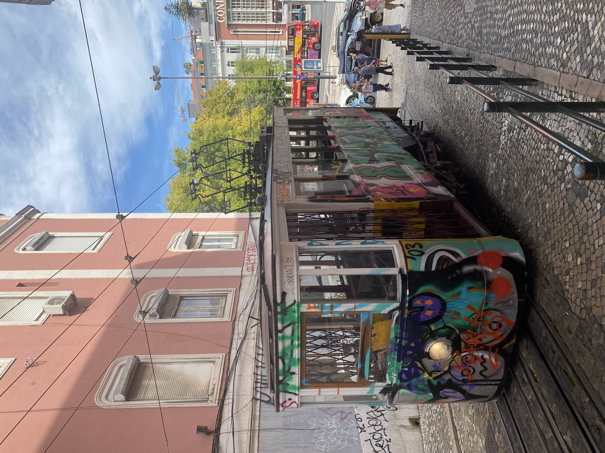
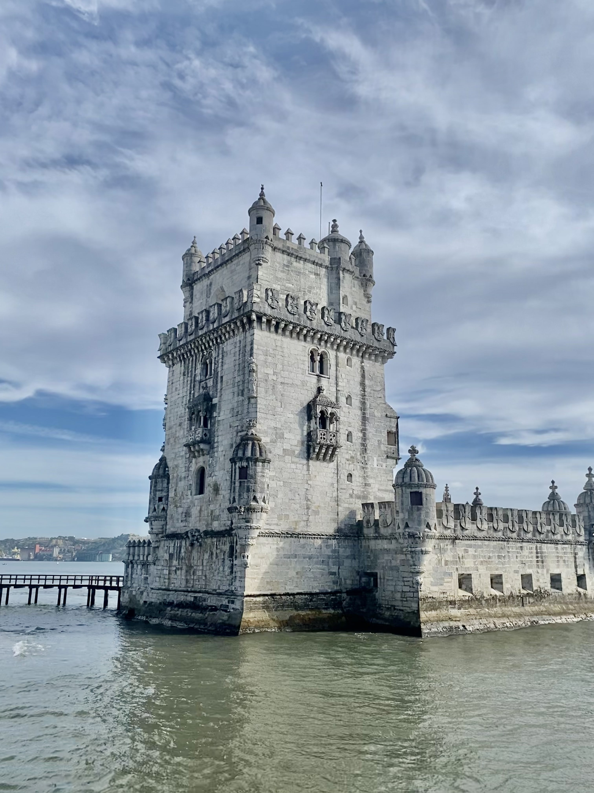

Lisbon is the capital and largest city of Portugal. It is located on the Atlantic coast and is known for its historic architecture and cultural landmarks, such as the Belem Tower and the Jeronimos Monastery. It is also known for its vibrant nightlife, delicious seafood, and picturesque neighborhoods like Alfama and Bairro Alto.

<!--truncate-->

### What to do
- Visit the historic Belem Tower and Jeronimos Monastery, which are UNESCO World Heritage sites and iconic landmarks of Lisbon.
- Take a tram ride through the city to explore the picturesque neighborhoods of Alfama, Bairro Alto, and Baixa.
- Enjoy the nightlife and live music in neighborhoods like Bairro Alto and Principe Real.
- Visit the Gulbenkian Museum, which has a wide collection of art and artifacts from around the world.
- Take a day trip to Sintra, a town located outside of Lisbon, known for its beautiful palaces and castles, including the Pena Palace and the Moorish Castle.

### What to eat
- Try the traditional dish of "bacalhau" (salt cod) which is prepared in various styles such as "à brás" or "com natas" (with cream).
- Sample some delicious seafood dishes, such as grilled sardines, octopus salad, and caldeirada (a fish stew).
- Enjoy a "pastel de nata" (custard tart), a famous Portuguese pastry that originated in Lisbon's Belém neighborhood.
- Try the traditional "cozido" a stew with various meats and vegetables, it is a hearty and comforting dish.
- Enjoy a glass of "vinho verde" a young wine from the Minho region in the north of Portugal, it's refreshing and perfect for a hot summer day.

