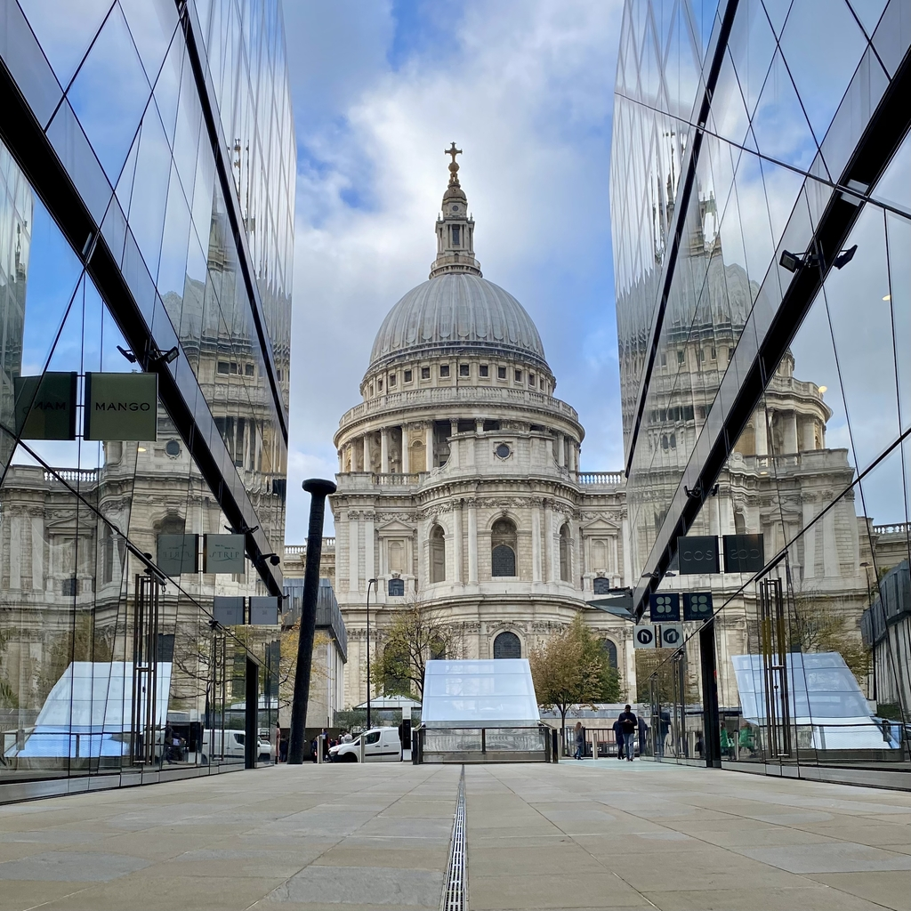
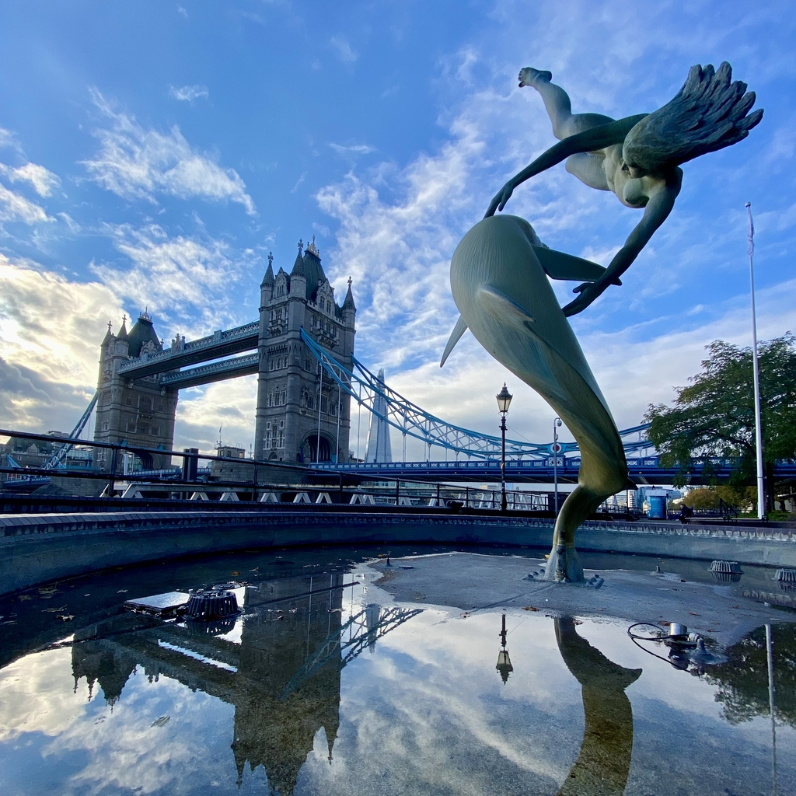
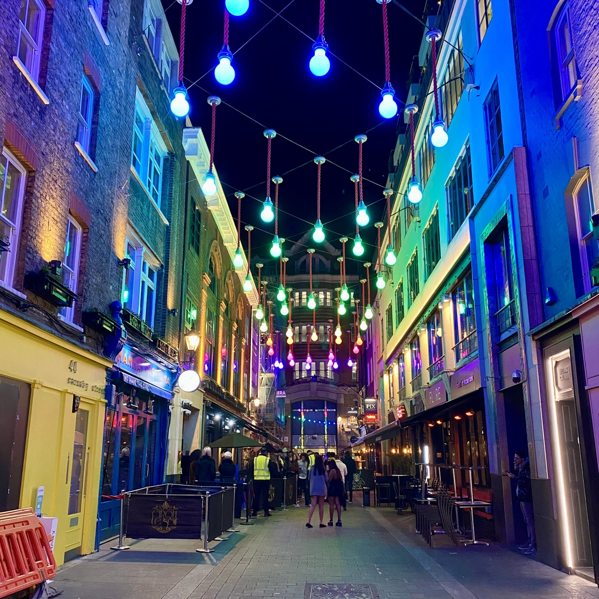

London is the capital and largest city of England, and the United Kingdom. It is a major cultural, financial, and political center, with a diverse population and a rich history. It is home to numerous iconic landmarks such as Buckingham Palace, Big Ben and the Tower of London, as well as world-renowned museums and galleries such as the British Museum and the National Gallery. London is also a major global hub for business and finance, and is considered one of the most important cities in the world.

<!--truncate-->

### What to do
- **The London Eye**: It is Europe's tallest ferries wheel (135 m), and is the most popular paid tourist attraction in the United Kingdom with over 3 million visitors annually. It gives unique views of the city. 

- **Tower Bridge** Built at the end of the 19th century it has two bascules, which could be raised to allow river traffic to pass while pedestrian could use the high level connection to continue using the bridge even when it was open.

- **The Mall** It is a road connecting Buckingham Palace and Trafalgar Square. Its surface is coloured red to give the effect of a giant red carpet.

- **Elizabeth Tower** I was surprised to know that Big Ben is the nickname for the Great Bell while the tower was originally called Clock Tower, but it was renamed Elizabeth Tower in 2012.

- **St Paul's Cathedral** is an Anglican cathedral in London. It was the tallest building in London from the 18th to the 20th century.

- **Camden Market** - a popular destination for both tourists and locals, Camden Market features a wide variety of street food vendors, as well as shops selling clothing, crafts, and other goods.

### What to eat
- **Fish and chips** - a classic British dish consisting of battered and deep-fried fish served with chips (french fries).
- **Roast beef and Yorkshire pudding** - a traditional English meal of roast beef served with a large, puffy, baked pudding made from flour, eggs, and milk.
- **Afternoon Tea** - a British tradition of drinking tea and eating small sandwiches and cakes. Many famous hotels in London offer afternoon tea service.

