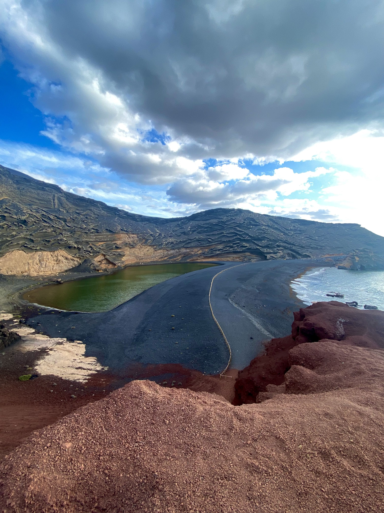
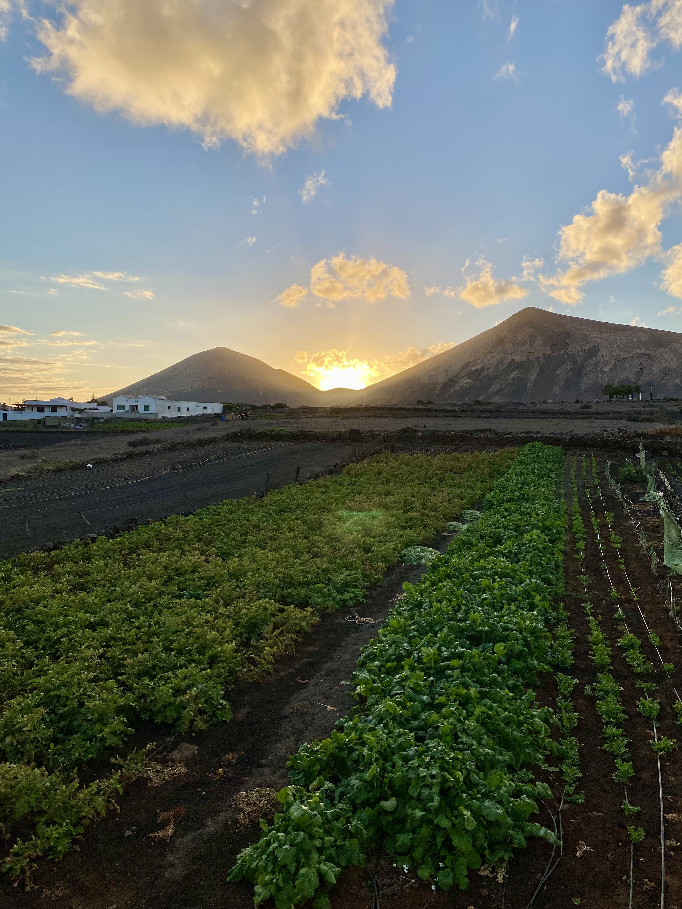

Lanzarote is a Spanish island located in the Atlantic Ocean off the coast of Africa. It is one of the Canary Islands and is known for its volcanic landscapes, black and white sandy beaches, and warm, dry climate. The island is a popular vacation destination for tourists from Europe and beyond.

<!--truncate-->

### What to do
- Visit the Timanfaya National Park, which features a moonscape of volcanic landscapes and geothermal activity. You can take a camel ride through the park or participate in a guided tour.

- Head to the island's capital, Arrecife, to explore its charming Old Town and visit the Castillo de San José, a castle turned museum that houses a collection of modern art.

- Take a dip in the crystal clear waters at one of the island's many beaches, such as Playa Blanca or Papagayo.

- Go scuba diving or snorkeling to explore the island's vibrant marine life, including colorful fish and sea turtles.

- Take a day trip to the neighboring island of Fuerteventura to experience its stunning beaches and sand dunes.

### What to eat
- Papas arrugadas: small, wrinkled potatoes boiled in saltwater and served with a spicy mojo sauce.

- Sancocho canario: a hearty stew made with fish, potatoes, and vegetables.

- Gofio: a toasted flour made from roasted grains, often mixed with water or milk to make a porridge or used as an ingredient in other dishes.

- Queso de cabra: goat cheese produced on the island and often served as a tapa (small appetizer).

- Mojo verde: a sauce made with parsley, garlic, oil, and vinegar, often served with grilled meats or papas arrugadas.

