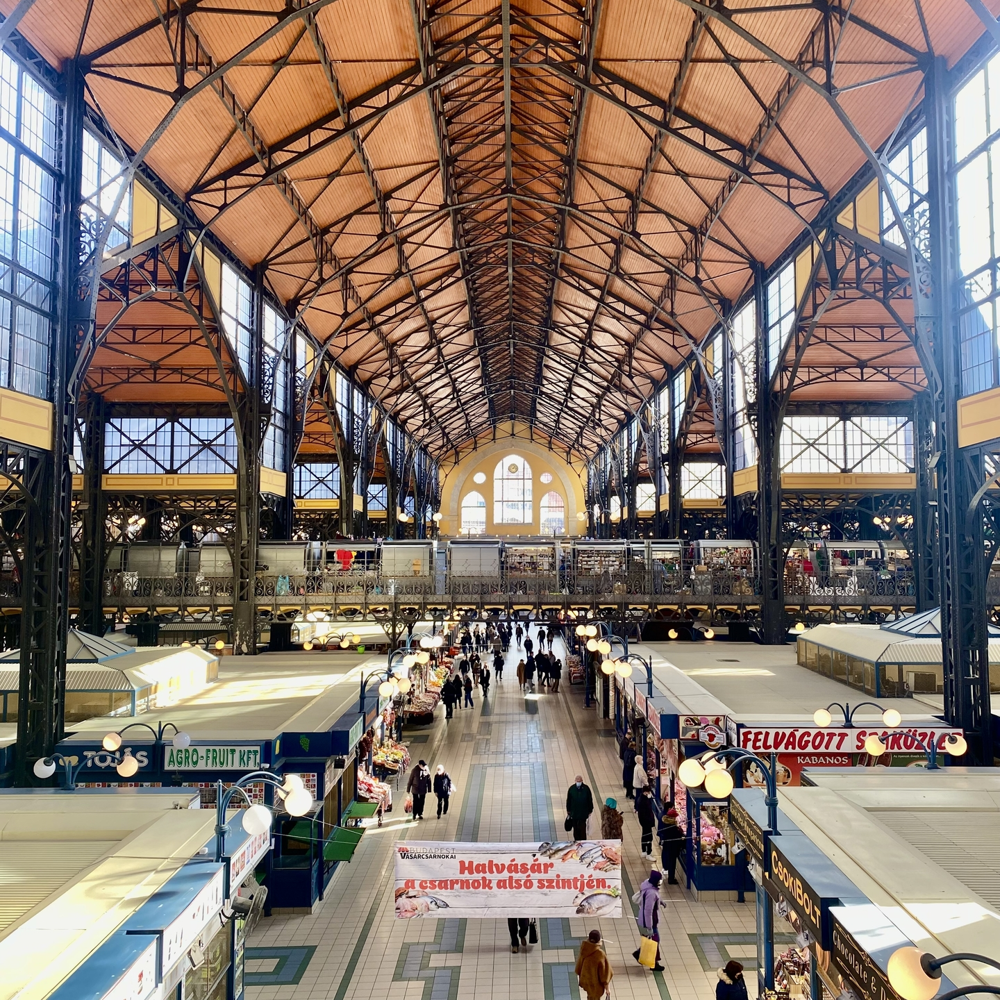

Capital of Hungary right in the middle of the country was founded merging two different cities: Buda and Pest.
The Danube River cut in half the city and create a natural separation between these two historic cities.
Buda located on the western side of the Danube represents the most historic parts of Budapest.
On the eastern side of the river there is Pest which is the commercial and administrative part of the city.

<!--truncate-->

### What to do
- Visit the Hungarian Parliament Building: right beside the Danube there is this impressive white. It is worthy to have a closer look at it during daylights and from the opposite bank of the river during night time with a really nice blue illumination.
- Relax in one of the city's thermal baths: The underground of Budapest is fulfil by natural hot springs and the Hungarian have taken good advantaged of it by building several thermal baths, the most iconic one is the Széchenyi Baths with several baths built in a historic palace and some external baths giving a shock experience, especially during winter time where the temperature from the water and outside can have a different of more than 30 C.
- Explore Fisherman’s Bastion: The logo of Walt Disney films, only nicer and older. It gives amazing views of the city and it is definitely a must see.
- Visit the Shoes on the Danube Bank: Situated near by the Parliament it is a memorial to honour the Jews who were asked to remove their shoes and were shot at the edge of the water so that their bodies fell into the river and were carried away. The memorial represents their shoes left behind on the bank.
- Check out the ruin bars: Unique bars that are built in abandoned buildings and decorated with eclectic artwork, giving them a vibrant and international atmosphere. They are a labyrinth and I was astonished by how small they look from the outside.
- Go to the Central market Hall: An amazing two floor market where it is possible to find several traditional local ingredients and dishes.

### What to eat
- Goulash: This hearty soup/stew is a Hungarian classic, made with beef, potatoes, carrots, paprika, and other spices.
- Langos: This deep-fried dough is a popular street food in Budapest, usually topped with sour cream, cheese, and garlic.

