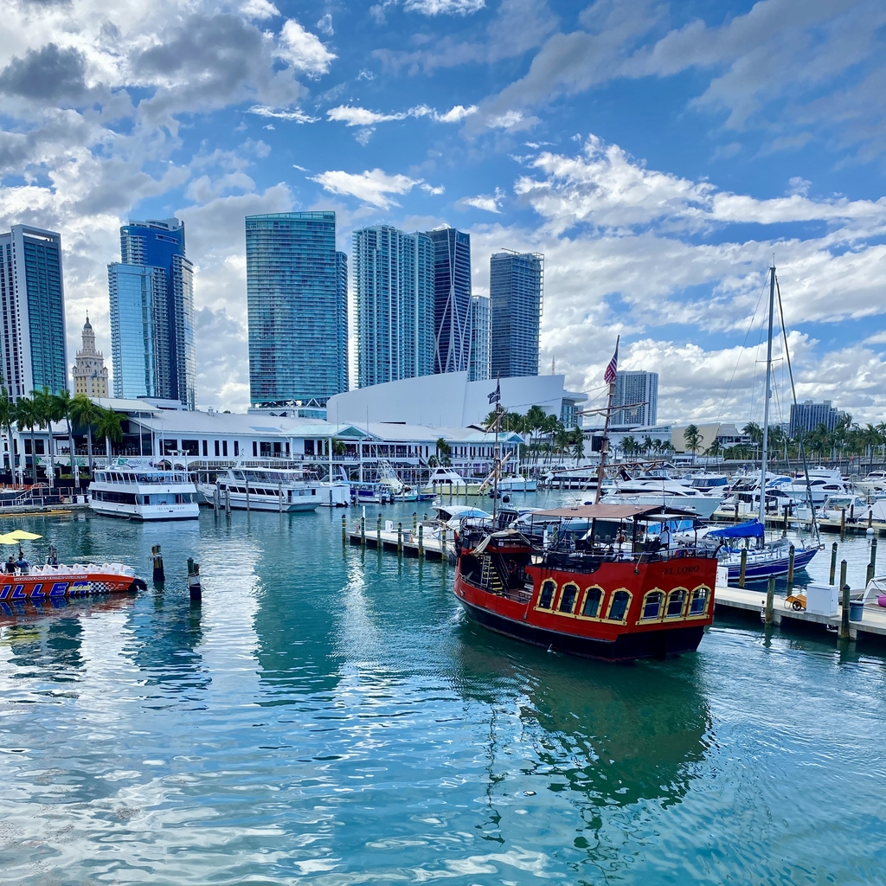
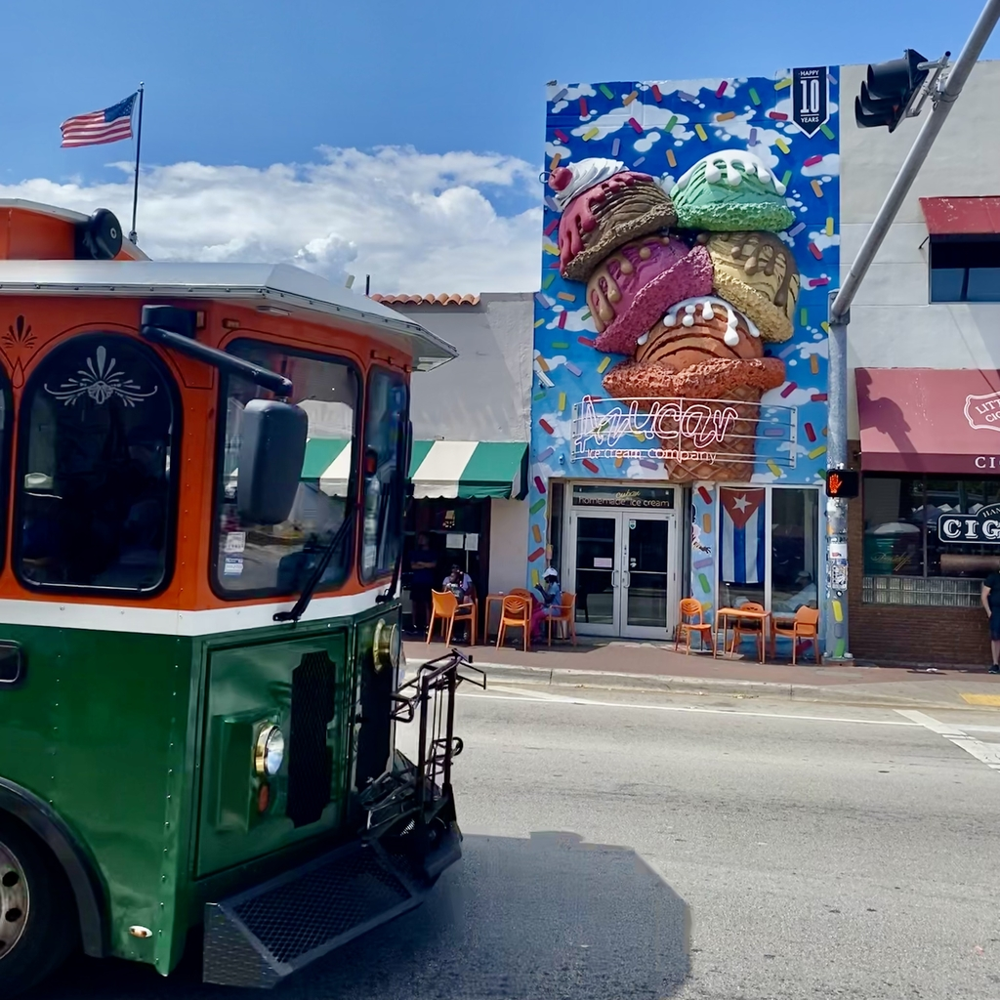

Miami is a city located in southeastern Florida in the United States. It is known for its beautiful beaches, vibrant nightlife, and diverse culture. It is also a major center for finance, trade, and entertainment in the region.

<!--truncate-->

### What to do
- Explore Miami Beach: Miami is home to some of the most beautiful beaches in the world, the most famous are located in South Beach surranded by tall buildings with long beaches and colorful lifeguard towers.

- Go to Little Havana: A [neighborhood](https://goo.gl/maps/sQYiAEAcbixdBhNk6) that is home to a large population of Cuban immigrants and their descendants. It is known for its lively atmosphere, colorful street art, and delicious Cuban food.

- Visit the [Bayside Marketplace](https://goo.gl/maps/8WZ5JXpTXnPG22Bd6): Bayside Marketplace is a shopping and entertainment complex located in downtown Miami, Florida. It is situated along the waterfront of Biscayne Bay and features a variety of retail stores, restaurants, and cafes. The complex is divided into two levels, with the upper level featuring open-air shopping and the lower level featuring a food court and live entertainment.
  
- Take a boat: You can find different daily tours starting at Bayside Marketplace which allows you to see Miami from a different point of view while seeing celebrities villas.

- Night out in [Ocean Drive](https://goo.gl/maps/S1nUxcbu2cCzXobA6): A popular street and tourist destination, with millions of visitors each year coming to experience the lively atmosphere and soak up the sun on the beach. In the evening, Ocean Drive comes alive with music and crowds of people enjoying the nightlife.

### What to eat
- [Azucar's](https://goo.gl/maps/ANoKaXgrTjqxjCfk8) ice cream: I was positively sursprised by the taste and quality of their ice cream, many particular flavours to try. When an Italian says an ice cream is good you should just try it.

- Empanadas: Empanadas are savory pastries filled with a variety of fillings, such as meat, vegetables, or cheese. They are a popular snack in Miami and can be found at many local bakeries and food trucks.

- Stone crabs: Miami is known for its delicious stone crabs, which are caught in the waters off the Florida coast and served chilled with mustard sauce. They are typically in season from October to May.

- Key lime pie: Key lime pie is a Florida favorite and Miami is the perfect place to try it. This dessert is made with a graham cracker crust, a filling of sweetened, condensed milk and key lime juice, and a topping of whipped cream.

- Ceviche: Ceviche is a popular seafood dish made with raw fish or shellfish that is "cooked" in citrus juice and seasoned with herbs and spices. It's a refreshing and light option that's perfect for a hot Miami day.

