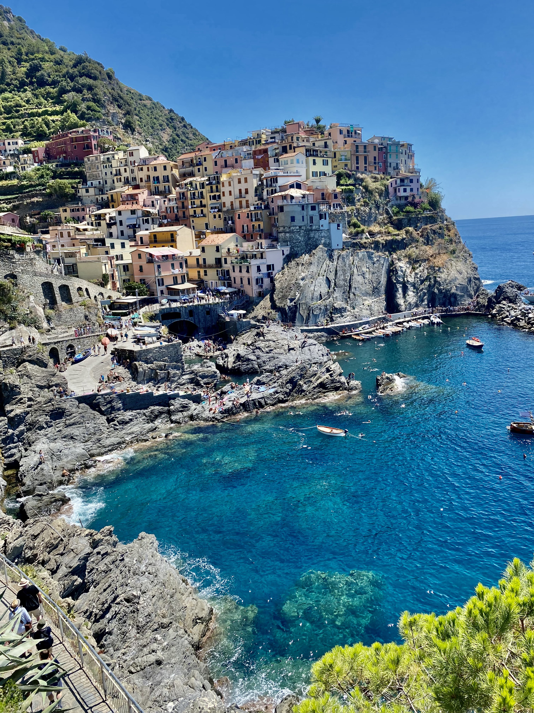
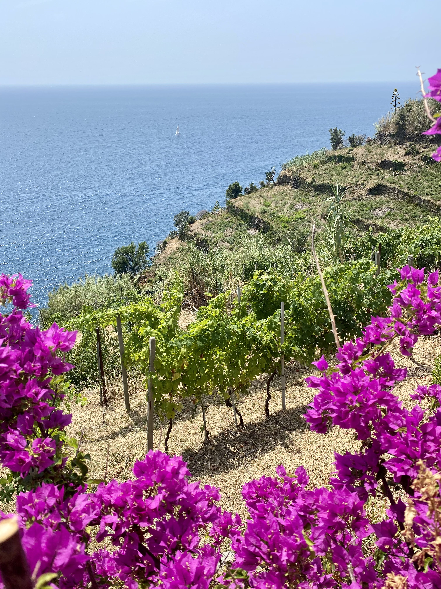
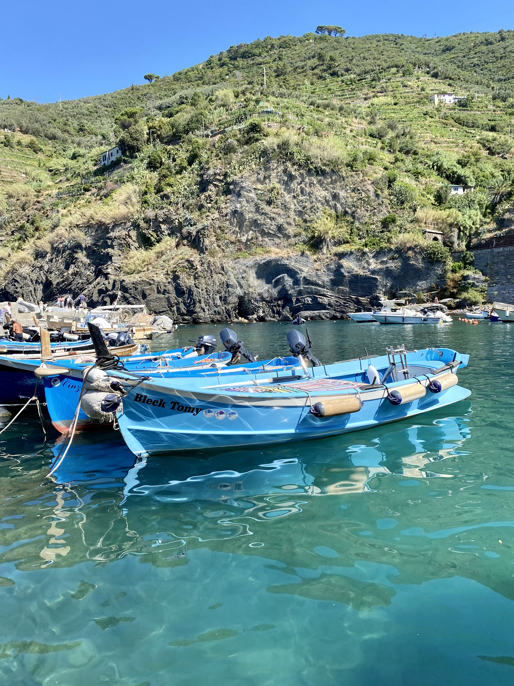

Cinque Terre is a region in Italy that consists of five coastal towns located in the Liguria region. It is known for its beautiful scenery, which includes colorful houses built into the cliffs, vineyards, and olive groves. It is a popular tourist destination for its beaches, hiking trails, and seafood.

<!--truncate-->

### What to do
- Walk: Cinque Terre are connected with a network of trails that offer stunning views of the coast and the towns. The avarage time to go from a town to another is two hours but there is always the train alternative which stops in every of the five towns.

- Explore the towns: Each of the five towns has its own character and charm. Take some time to wander the narrow streets, visit the local churches and museums, and try the local food and wine.

- Visit the beaches: The region has several beautiful beaches, including Monterosso al Mare, Vernazza, and Riomaggiore.

- Take the ferry: The ferry is a great way to see the coastline from a different perspective while moving from one town to another.

### What to eat
- Focaccia: Focaccia is a flat bread that is popular in Cinque Terre. It is typically topped with herbs, olives, and salt, and it is often served as an appetizer or snack. If you want to have a real Ligurian experiance try a breakfast with warm Focaccia and Cappuccino.

- Pesto: Pesto is a sauce made from basil, pine nuts, and garlic, and it is a specialty of the Liguria region. It is often served with Trofie, a type of pasta that is native to Liguria.

- Seafood: Cinque Terre is known for its seafood, and you can find a variety of dishes featuring fish, shellfish, and other seafood.

- Gelato: No trip to Italy is complete without trying some gelato, and Cinque Terre is no exception. Be sure to sample the local flavors, such as lemon and basil.

