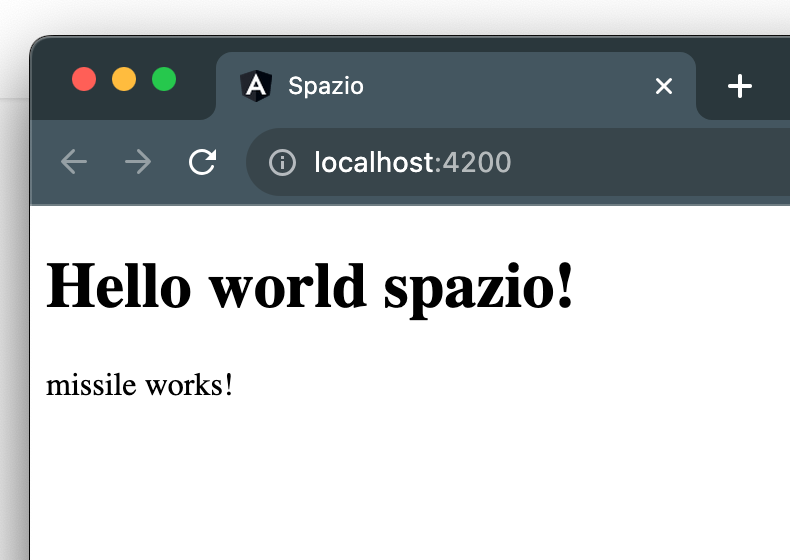

# Data binding

We have seen how the HTML used in the template file is loaded into the browser when we instantiate a new component through the selector.

While we have seen that, through the TypeScript file, we define a class that represents the functionality of the component.

Let's take the `App` component as an example. In its TypeScript file, we find:

```ts title="app.component.ts"
export class AppComponent {
  title = 'spazio';
}
```

The `title` is defined within the `AppComponent` class as a property.

How do we use this property within the `app.component.html` template?

We can access each property through a mechanism in Angular called data binding. Here is the first syntax difference between an HTML document and an Angular template: by using the `{{🐧PROPERTY_NAME🐧}}` syntax, we can retrieve any property from the class.

We can use this syntax anywhere within the HTML structure, both outside:

```html
<h3>Wish List:</h3>
{{title}}
<ul>
  <li>I want a penguin<li>
</ul>
```

And inside tags:

```html
<h3>Wish List:</h3>
<ul>
  <li>I want a penguin {{title}}<li>
</ul>
```

Let's now use data binding in the title of our app:

```diff title="app.component.html"
- <h1>Hello world Angular!</h1>
+ <h1>Hello world {{title}}!</h1>
```

The browser will now load the final result:



Now, as a small task, let's change `title` to `titolo`. The changes need to be made in two files, and the final result in the browser should not change.

:::info
Confused? You can find the code changes made in this lesson [here](https://github.com/lucatardi/spazio/commit/ac7b178539748aa1ceee67bbf007c15095bf2db9?diff=split).
:::