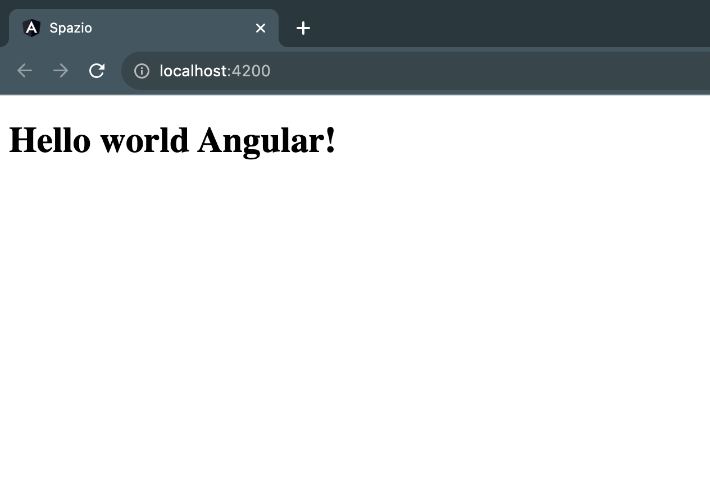

# Hello world Angular

Let's try to run the application in our localhost, to do so we can use the Angular CLI `ng serve` command. This command will start a local server and run the application at [http://localhost:4200/](http://localhost:4200/).

What we see It is some content placeholder Angular CLI created for us, the code can be found in the `app.component.html` file.. we delete almost all the content as suggested by the comments and as first line of this file we write:

```html
<h1>Hello world Angular!</h1>
```

Now taking a look at the browser we see that our new content is visible:




:::info
You can find the commit with the related changes [here](https://github.com/lucatardi/spazio/commit/06ad041ef6aadfe05a1f41df48ce33f3e9061b28).
:::