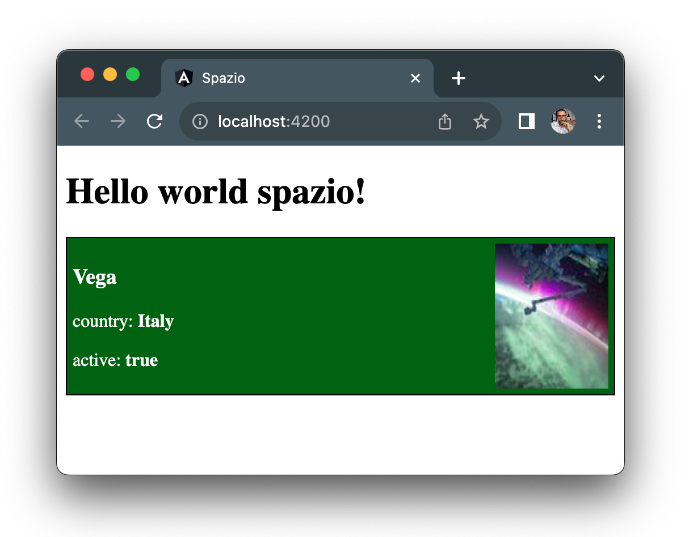

# Styling a Component

Styling a component in Angular is done by writing CSS in the component's style file, just as you would for any CSS file linked to an HTML file. The strength of Angular is automatic style encapsulation; in fact, all CSS within a component is not applied outside of it. This avoids the need to be specific in selectors in our components or to have CSS from other components applied to our new component.

Let's add the `card` class as a selector to the outer div of the missile component:

```diff title="missile.component.html"
- <div>
+ <div class="card">
  <h3>{{missile.name}}</h3>
```

Then, in the missile component's CSS, target the `card` class:

```css title="missile.component.css"
.card {
  border: 1px solid black;
  padding: 5px;
}
```

This way, we would be able to see a black border around the missile component. Now, if you have worked with CSS before, you may notice that the choice of the very generic `card` selector could potentially lead to issues. For example, another developer might decide to use the same `card` selector in any other component for a different set of styles. However, even if this happens, our border won't be applied thanks to Angular's style encapsulation mechanism.

Angular helps us even more when we want to apply CSS dynamically. Let's say we want to make the missile's state even more visible by applying a green background when the missile is active and a gray background when it's inactive.

Add the following two new selectors, `active` and `inactive`, to the CSS below the `card` selector:

```css title="missile.component.css"
.active {
  background-color: darkgreen;
  color: white;
}

.inactive {
  background-color: lightgray;
  color: black;
}
```

Now, let's move to the template file where we have the `missile.active` value, and we want to apply either the `active` or `inactive` class depending on the `true` or `false` value of that property. How can we do that?

Inside Angular's property binding, we can execute JavaScript code. In this case, using the ternary operator, we can return the correct class:

```diff title="missile.component.html"
- <div class="card">
+ <div class="card {{missile.active ? 'active' : 'inactive' }}">
  <h3>{{missile.name}}</h3>
```

When Angular compiles this new line of code, it will follow these steps:
1. Is there a property binding symbol `{{ }}` in this line of code?
2. Yes, so let's resolve that first:
3. `missile.active ? 'active' : 'inactive'` - the missile is active, so the result of this ternary operator is the string `'active'`.
4. Replace the result and continue with the normal HTML reading, resulting in this final output: `<div class="card active">`.

Finally, let's improve the component's layout a bit by adding an image and applying basic flexbox to make it look slightly more appealing:

```diff title="missile.component.html"
+  <div>
    <h3>{{missile.name}}</h3>
    <p>Country: <b>{{missile.country}}</b></p>
    <p>Active: <b>{{missile.active}}</b></p>
+  </div>
+  
```

```diff title="missile.component.css"
.card {
  border: 1px solid black;
  padding: 5px;
+  display: flex;
+  justify-content: space-between;
}
```

The result in the browser should look like this:



Changing the `active` property from `true` to `false` and vice versa should change the color:

