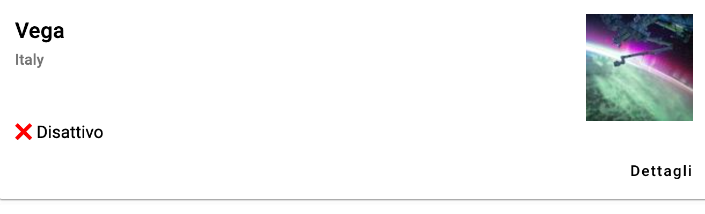

# The Material Library

Like every web development framework, a fundamental part is all the third-party libraries that we can install and integrate into our application.

There are libraries for every need, and in our case, we're interested in a library that provides components to make our UI look a bit nicer and more professional. The library we're looking at is called Material, and it's a component library developed by Google.

We can install a library using the Angular CLI command `ng add 🐧PACKAGE_LIBRARY_NAME🐧`. In the case of Material:

```shell
ng add @angular/material
```

During the installation, you'll be prompted for some configurations, such as the theme type or animation type. For the purpose of this course, you can proceed with the standard installation by pressing Enter for all the questions.

Once that's done, you'll see that the CLI modifies various configuration files to enable the newly installed library.

Initially, we want to use two Material components: `<mat-card>` and `<mat-button>`. Open the module file and import them:

```diff title="app.module.ts"
+ import { MatCardModule } from '@angular/material/card';
+ import { MatButtonModule } from '@angular/material/button';
```

Finally, register the imported modules by adding them to the `imports` array:

```diff title="app.module.ts"
imports: [
    BrowserModule,
    AppRoutingModule,
    BrowserAnimationsModule,
+   MatCardModule,
+   MatButtonModule
  ],
```

By doing this, we can now use these components in the templates of all the components included in this module (which means the entire application in our case).

Let's replace the template of the `missile` component with the following:

```html title="missile.component.html"
<mat-card *ngIf="missile">
  <mat-card-header>
    <mat-card-title-group>
      <mat-card-title>{{missile.name}}</mat-card-title>
      <mat-card-subtitle>{{missile.country}}</mat-card-subtitle>
      
    </mat-card-title-group>
  </mat-card-header>
  <mat-card-content>
    {{missile.active ? '✅ Active' : '❌ Inactive'}}
  </mat-card-content>
</mat-card>
```

As you can see here, we're using the new card components, all of which are part of the `MatCardModule` module imported earlier. Let's now add a button to navigate to the missile's detail page:

```diff title="missile.component.html"
</mat-card-content>
+ <mat-card-actions align="end">
+   <button mat-button routerLink="/missile/{{missile.id}}">Details</button>
+ </mat-card-actions>
</mat-card>
```

The `routerLink` property instructs the Angular router to add the value passed to the URL. Now, each missile has a button that allows navigation to the detail page.



Now, let's improve the detail page. Import and register another Material module called `MatListModule` to insert a list.

Then, use the list in the `missile-info` component like this:

```html title="missile-info.component.html"
<mat-list *ngIf="missile">
  
  <mat-list-item *ngFor="let item of missile | keyvalue">
    <span matListItemTitle>{{item.key}}</span>
    <span matListItemLine>{{item.value}}</span>
  </mat-list-item>
</mat-list>
```

:::info
Find the modified code for this lesson [here](https://github.com/lucatardi/spazio/commit/e14fa4d90922f72a1b0e444c2a8d878ad983d9ac?diff=split).
:::