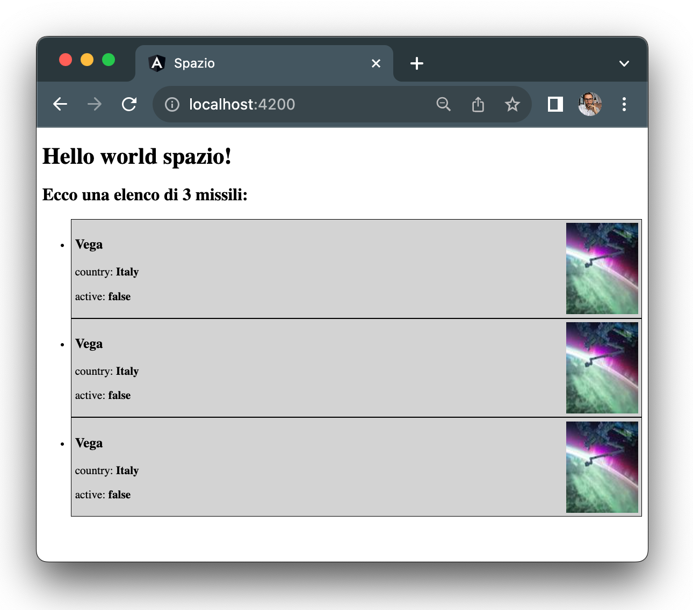

# A List of Missiles

Now that we have the `missile` component, we can reuse it to represent as many missiles as we want.

Let's create a component using Angular CLI called `missile-list` that will contain all the missiles we want to display to the user:

```shell
ng generate component missile-list
```

Inside the folder created by the CLI, let's add the template for the new component:

```html title="missile-list.component.html"
<h2>Here's a list of 3 missiles</h2>
<ul>
  <li>
    <missile></missile>
  </li>
  <li>
    <missile></missile>
  </li>
  <li>
    <missile></missile>
  </li>
</ul>
```

As you can see, the missile list will have a title and an unordered list of three missiles inside `<li>` elements.

Now, let's go to the `app.component.html` file to make a change: we want to load the `missile-list` component instead of the individual `missile` component that we had there. It will be the responsibility of the `missile-list` component to load the three `missile` components inside it:

```diff title="app.component.html"
<h1>Hello world {{title}}!</h1>
- <missile></missile>
+ <missile-list></missile-list>
<router-outlet></router-outlet>
```

Now, let's check the result in the browser, and 💥...


Why can't we see the application anymore, and why is this error appearing in our browser? The first step in troubleshooting a problem is to read the clues presented to us:

First, the error mentions that `missile-list` is not a recognized Angular component and shows that the problem occurs when we use `<missile-list>` in the template.

Did we forget something? Yes, when we create a component with the CLI, the selector's name is automatically set to `app-🐧COMPONENT_NAME🐧`. When we created the `missile` component, we changed the selector, but in the case of the `missile-list` component, we didn't. This means Angular doesn't understand what we mean by `<missile-list>`, as the component it recognizes is `<app-missile-list>`.

To fix this problem, we need to make a simple modification in the definition of the `missile-list` component:

```diff title="missile-list.component.ts"
@Component({
- selector: 'app-missile-list',
+ selector: 'missile-list',
  templateUrl: './missile-list.component.html',
  styleUrls: ['./missile-list.component.css']
})
```

The error should be resolved, and the browser should load the following interface:



Observing the page, we can see two things that need to be fixed:

1. We need to style the list to make it more visually appealing.
2. We have a list of three identical missiles, and we need to extend the list to have distinct missiles.

Starting with the first point, let's assign a `list` class to the list:

```diff title="missile-list.component.html"
<h2>Here's a list of 3 missiles</h2>
- <ul>
+ <ul class="list">
```

Then, add some styling in the corresponding CSS file:

```css title="missile-list.component.css"
.list {
  list-style-type: none;
  padding: 0;
  margin: 0;
  display: flex;
  flex-direction: column;
  gap: 5px;
}
```

Now that the styling of our component is sorted out, let's address the second point:

Currently, the information for a missile is contained in the definition of the `missile` component. What we need to do is accept this information from the list component. Let's start by adding an array containing three missiles to the list:

```ts title="missile-list.component.ts"
export class MissileListComponent {
   missiles: Missile[] = [
    {
     name: 'Vega',
     country: 'Italy',
     active: false
    },
    {
      name: 'Tomahawk',
      country: 'United States',
      active: true
    },
    {
      name: 'BrahMos',
      country: 'India',
      active: false
    },
   ]
}
```

Now we have this array of `missiles` available to use in the template of the `missile-list` component. But how do we pass the information to the `missile` component?

We can use a mechanism similar to property binding. In fact, we can pass information from a parent component, in our case `missile-list`, to a child component (`missile`) using this syntax:

```html
<component-name [property-name]="property-value">
```

Inside the `component-name`, we then have access to the `property-value` through a property named `property-name`, which acts as an input for the `component-name`.

In the template of `missile-list`, let's try passing different missiles as properties to the child components:

```diff "missile-list.component.html"
<li>
-  <missile></missile>
+  <missile [missile]="missiles[0]"></missile>
</li>
<li>
-  <missile></missile>
+  <missile [missile]="missiles[1]"></missile>
</li>
<li>
-  <missile></missile>
+  <missile [missile]="missiles[2]"></missile>
</li>
```

Now we need to instruct the `missile` component to accept the new `[missile]` property. To do this, let's modify the definition of the `missile` component using the `Input` decorator, which we find in Angular just like we imported the `Component` decorator:

```diff title="missile.component.ts"
- import { Component } from '@angular/core';
+ import { Component, Input } from '@angular/core';
import { Missile } from './missile';

@Component({
  selector: 'missile',
  templateUrl: './missile.component.html',
  styleUrls: ['./missile.component.css']
})
export class MissileComponent {
-  missile: Missile = {
-    name: 'Vega',
-    country: 'Italy',
-    active: true
-  };
+ @Input() missile: Missile = { name: '', country: '', active: false}; 
}
```

Let's summarize what we've changed:

1. We imported the `Input` decorator from Angular.
2. We removed the static `missile` object that was assigned inside the component.
3. Using the `@Input()` decorator, we defined `missile` as a property accepted from outside the component of type `Missile` with a default value of an empty object.

Now in the browser, you should see the correct representation of the list with the three missiles:


:::info
Did you get lost in the steps of this lesson? Check [here](https://github.com/lucatardi/spazio/commit/6666649eed09f155f2043d8343f4ff865c8692f1?diff=split) for the code.
:::


