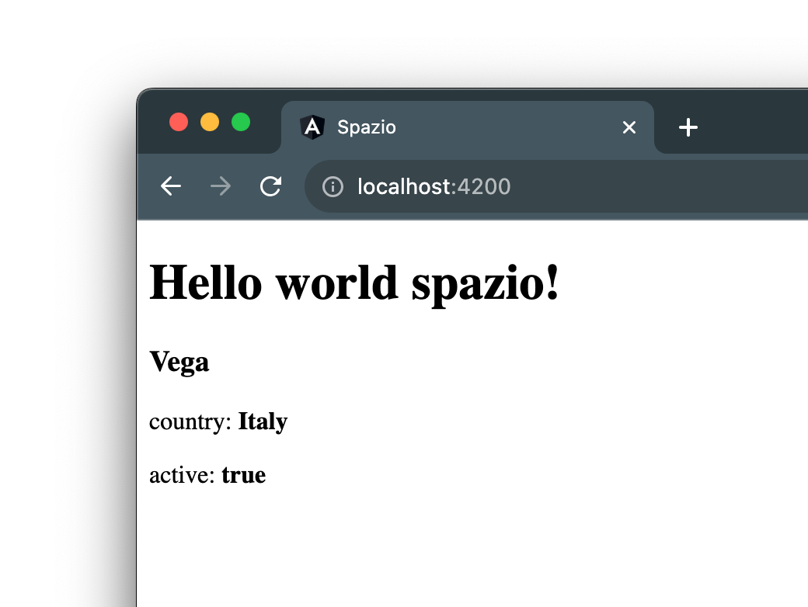

# The Missile Type

Let's start enriching our missile component. In its definition in the `missile.component.ts` file, let's add a property called `missile`.

How do we represent a missile?

The information a missile should have includes the following:

- **name**: a string representing the missile's name.
- **country**: a string representing the missile's country of origin.
- **active**: a boolean indicating whether the missile is active or not.

Let's create a `Missile` type to describe these three properties, in three steps:

1. Create a file in the `missile` folder called `missile.ts`. This will be the file containing all the types we need for the missile component.
2. Define the `Missile` type.
3. Export the newly created type so we can use it in other files.

```ts title="missile.ts"
export type Missile = {
  name: string;
  country: string;
  active: boolean;
}
```

Now that we have the `Missile` type available, let's import it into our `missile.component.ts` file and use it as the type for the property we created earlier, assigning some values:

```ts title="missile.component.ts"
export class MissileComponent {
  missile: Missile = {
    name: 'Vega',
    country: 'Italy',
    active: true
  };
}
```

Now, let's move to the template and create a simple HTML structure to display the data we inserted in the component's definition:

```html title="missile.component.html"
<div>
  <h3>{{missile.name}}</h3>
  <p>Country: <b>{{missile.country}}</b></p>
  <p>Active: <b>{{missile.active}}</b></p>
</div>
```

As you can see, we first access the `missile` property and then its contents.

The result in the browser will be as follows:



:::info
You can find the changes made in this lesson [here](https://github.com/lucatardi/spazio/commit/1f798725fd8eb2eff80a2a09220408c4ccd9ed22?diff=split).
:::