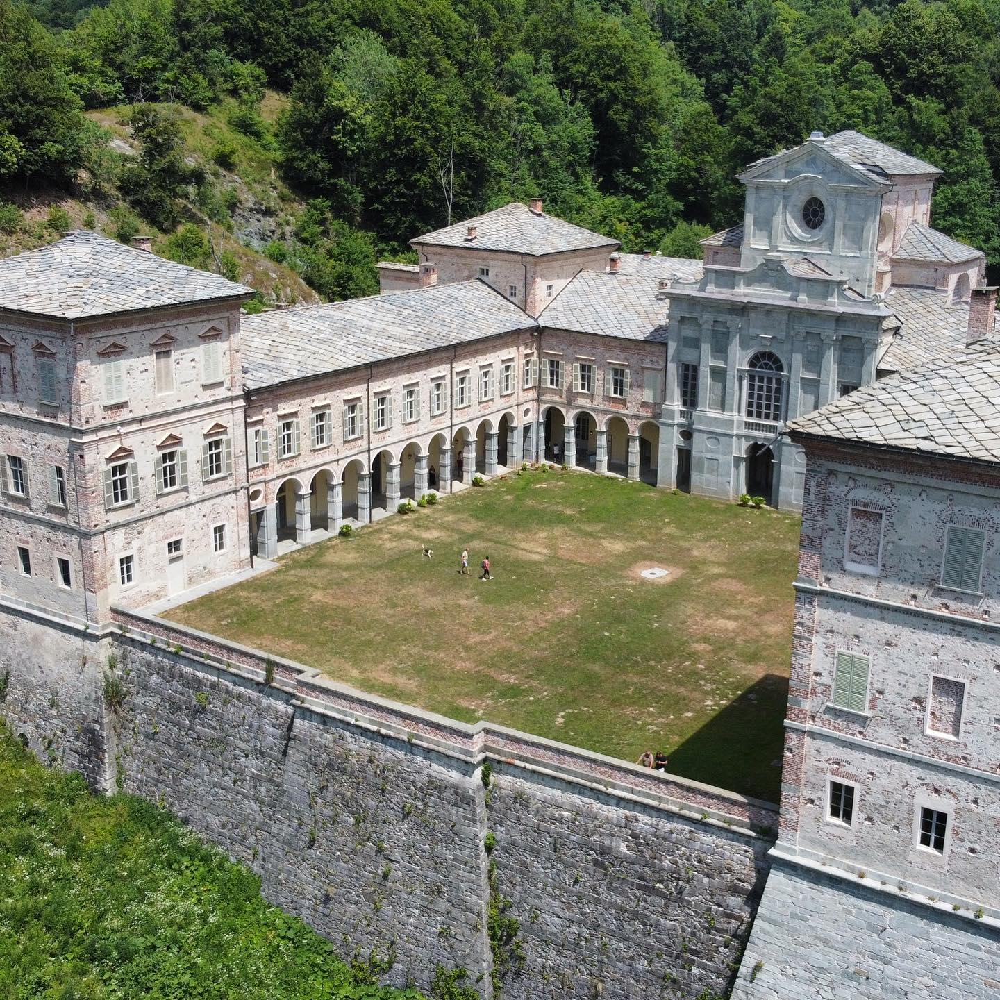
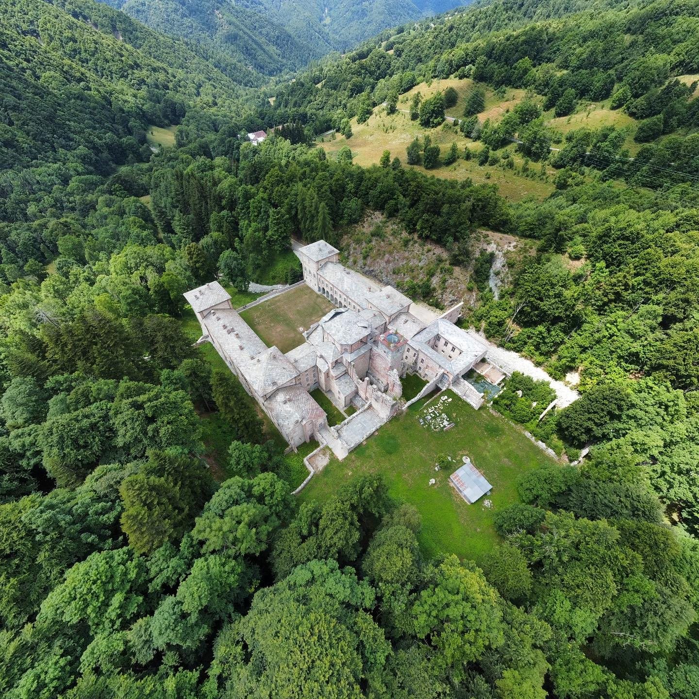
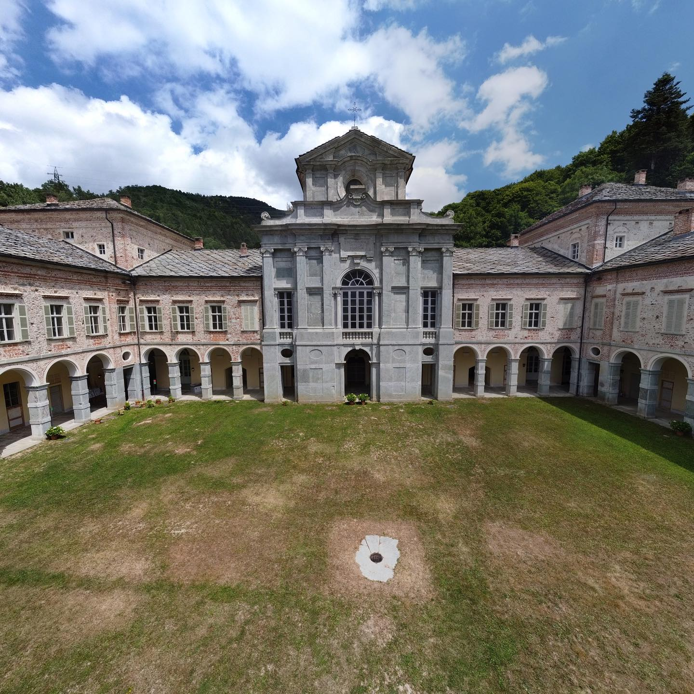

Nascosto nella valle di Valcasotto e incastonato tra le verdi montagne si trova una gemma bianca: La reggia di Valcasotto, un enorme palazzo costruito intorno al 1100.

<!--truncate-->

### La storia

La reggia di Valcasotto è stata utilizzata per diversi scopi durante la sua lunga storia. È stata inizialmente costruita come monastero Certosino, uno dei più rigorosi ordini monastici della Chiesa cattolica. I frati Certosini sono noti per il loro modo di vivere che enfatizza preghiera e solitudine. Dopo più di 700 anni, la reggia fu acquistata dalla famiglia reale dei Savoia e divenne la loro riserva di caccia. Era uno dei posti preferiti da Vittorio Emanuele II, il primo re d'Italia. La reggia è stata poi recentemente acquistata dalla regione Piemonte, che l'ha aperta al pubblico.

### Come visitarla

Il modo migliore per raggiungere [la reggia di Valcasotto](https://goo.gl/maps/gs2JTXCthkbqRPSy7) è in auto, a 30 minuti di guida da Garessio percorrendo una strada montana asfaltata. L'ingresso all'area principale è gratuito ma per visitare l'interno è necessario acquistare un biglietto di 10 euro. La reggia è spesso chiusa, quindi è consigliabile verificare gli orari di apertura sul [suo sito web ufficiale](https://www.comune.garessio.cn.it/vivere-il-comune/cosa-vedere/castello-di-casotto-sec-xii-17706-1-d1ce67833a3f32c7f08cd5dbdefa59a1) prima di visitarla. 
C'è un piccolo bar e ristorante situato accanto all'ingresso, che serve deliziosi e particolari panini.

