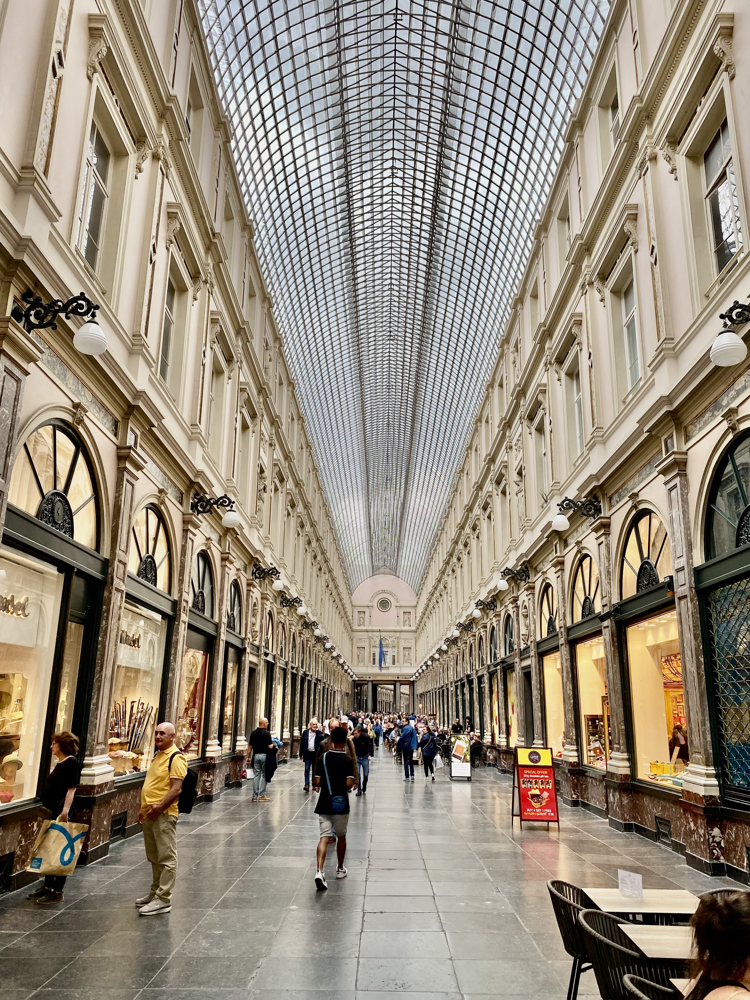

Bruxelles è la capitale del Belgio, situata nel centro del paese. È famosa per i suoi monumenti storici e le istituzioni culturali, nonché per il suo ruolo come sede dell'Unione Europea. La città è conosciuta per il cioccolato, le gaufre e la birra, e viene spesso definita la "Capitale d'Europa".

### Cose da fare
- Visita l'Atomium, una struttura in acciaio modernista costruita per l'Esposizione Universale del 1958.
- Esplora la Grand Place, un sito Patrimonio dell'Umanità dell'UNESCO e la piazza centrale di Bruxelles, circondata da antiche sedi di corporazioni e dal municipio della città.
- Fai una visita alle istituzioni dell'Unione Europea, come la Commissione Europea e il Parlamento Europeo.
- Visita il Manneken Pis, una statua di bronzo di un bambino che piscia e che è diventata un simbolo della città.
- Assaggia la cucina locale, come le gaufre belghe, il cioccolato e la birra. Ci sono molti ristoranti e caffè in città che servono questi piatti.

### Cose da mangiare
- Gaufre belghe: si tratta di un cibo di strada molto popolare a Bruxelles, preparato con una pastella spessa e soffice che viene cotta in una piastra per waffle. Spesso vengono servite con panna montata e frutta.
- Cioccolato belga: il Belgio è conosciuto per il suo cioccolato di alta qualità, e a Bruxelles ci sono molti negozi di cioccolato dove è possibile provare una varietà di cioccolati diversi.
- Moules-frites: si tratta di un piatto tradizionale belga a base di cozze e patatine fritte. Le cozze vengono solitamente servite in un brodo preparato con vino bianco e scalogno.
- Stoemp: si tratta di un piatto tradizionale belga a base di patate schiacciate e verdure, come carote, cavoli di Bruxelles o rape. Viene spesso servito come contorno.
- Birra belga: il Belgio ospita una ampia varietà di birre, come lambic, saison e abbey beer. A Bruxelles ci sono molti bar e birrifici dove è possibile provare diverse tipologie di birra belga.

