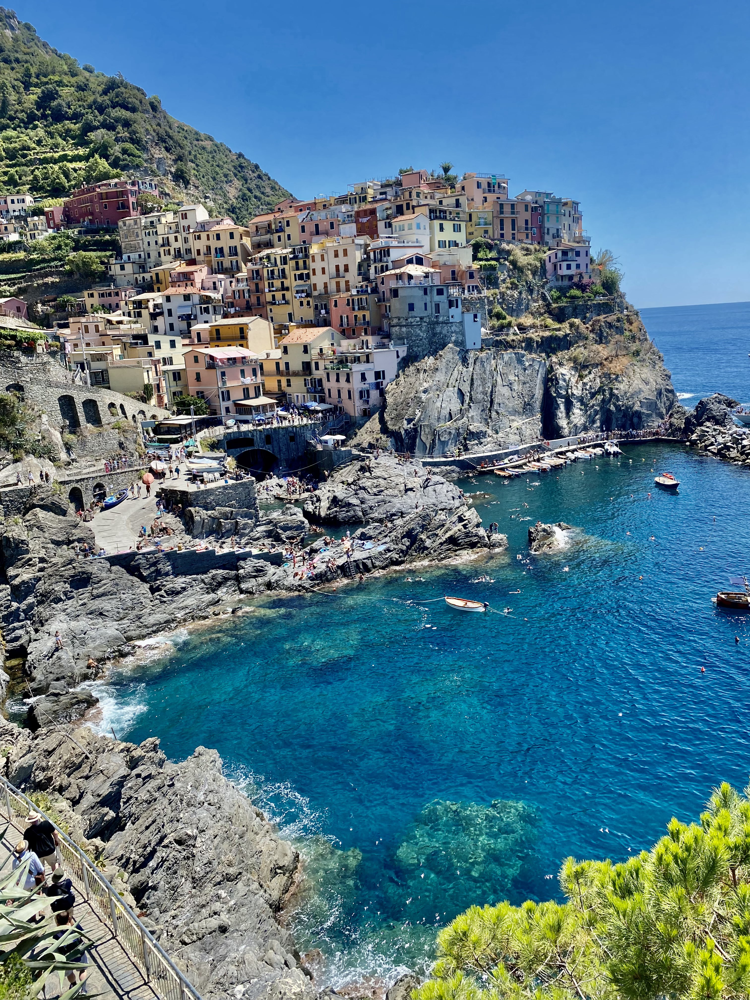
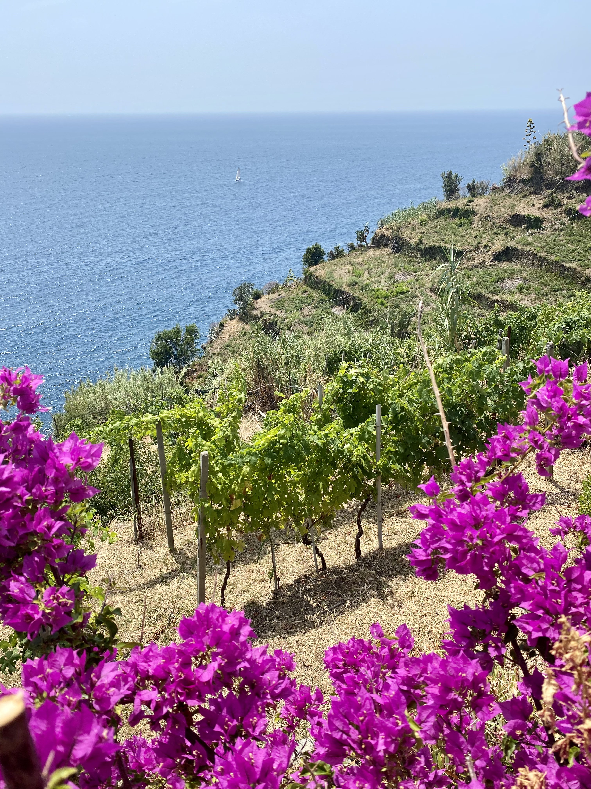
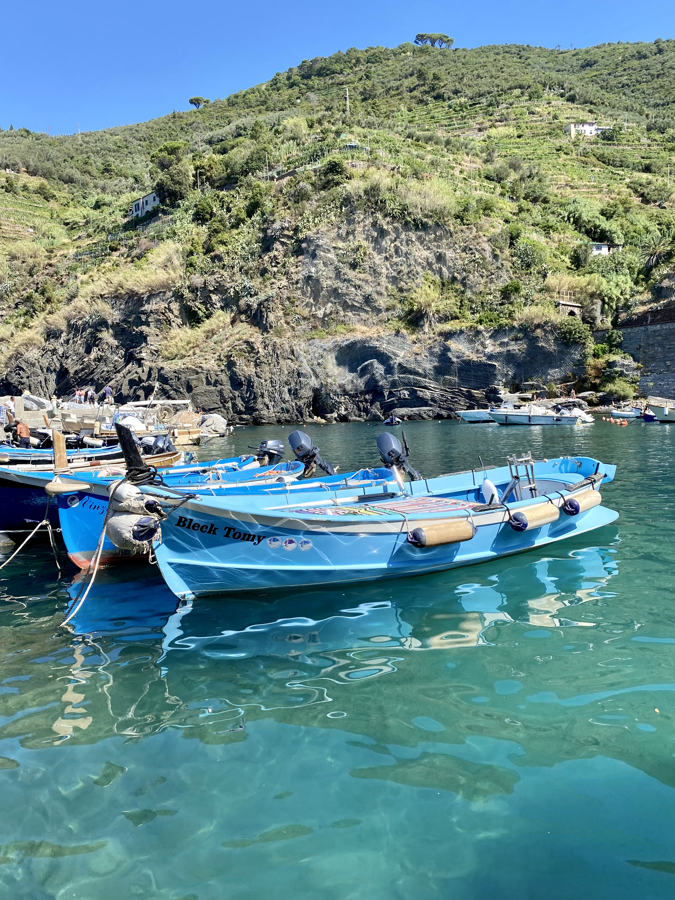

Le Cinque Terre si trovano sulla costa Ligure in Italia, e sono composte da cinque piccoli borghi. Sono famose per il loro paesaggio mozzafiato, che comprende case colorate costruite sugli scogli, vigneti e uliveti. Sono una popolare destinazione turistica per le loro spiagge, i sentieri escursionistici e il pesce. Le Cinque Terre sono anche conosciute per la loro produzione di vino e olio d'oliva di alta qualità.

### Cosa fare
- Camminare: Le Cinque Terre sono connesse tra loro da piccoli sentieri, che offrono viste mozzafiato ed uniche sulla costa e sui borghi. Come media la percorrenza tra un borgo ed un altro e' di circa due ore ma vi e' sempre l'alternativa del treno, comodo e che ferma in tutti e cinque i borghi.

- Esplorate i borghi: Ognuno dei cinque borghi ha il suo carattere e fascino. Prendetevi un po' di tempo per passeggiare per le strette strade, visitare le chiese e i musei locali e assaggiare il cibo e il vino locali.

- Visitate le spiagge: La regione è dotata di diverse bellissime spiagge, tra cui Monterosso al Mare, Vernazza e Riomaggiore.

- Prendere il traghetto: Il traghetto è un ottimo modo con il quale spostarsi da un borgo all'altro mentre si ammira la costa ed una prospettiva diversa sui borghi.

### Cosa mangiare

- Focaccia: La focaccia è un tipo di pane piatto molto popolare nelle Cinque Terre. Di solito è condita con erbe, olive e sale, e viene spesso servita come antipasto o snack ma se volete provare la vera esperienza ligure vi consiglio una colazione con focaccia calda pucciata nel cappuccino.

- Pesto: Il pesto è una salsa a base di basilico, pinoli e aglio, ed è una specialità della regione della Liguria. Viene spesso servito con le trofie, un tipo di pasta originaria della Liguria.

- Pesce: Le Cinque Terre sono famose per il loro pesce, e si possono trovare diversi piatti a base di pesce, crostacei e altri frutti di mare.

- Gelato: Un viaggio in Italia non è completo senza aver assaggiato il gelato, e le Cinque Terre non fanno eccezione. Assaggiate i gusti locali, come il limone e il basilico.

