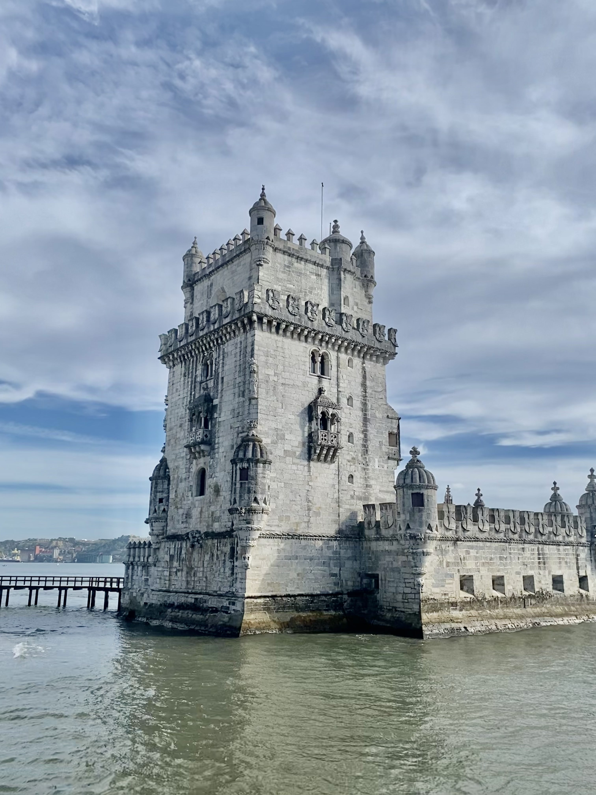

Lisbona è la capitale e la città più grande del Portogallo. Si trova sulla costa Atlantica ed è famosa per la sua architettura storica e i suoi siti culturali come la Torre di Belem e il Monastero di Jeronimos. E' anche conosciuta per la vivace vita notturna, il delizioso pesce e i quartieri pittoreschi come Alfama e Bairro Alto.

<!--truncate-->

### Cosa fare
- Visita la storica Torre di Belem e il Monastero di Jeronimos, patrimonio dell'umanità UNESCO e icone di Lisbona.
- Fai un giro in tram per esplorare i quartieri pittoreschi di Alfama, Bairro Alto e Baixa.
- Goditi la vita notturna e la musica dal vivo nei quartieri di Bairro Alto e Principe Real.
- Visita il Museo Gulbenkian, che ospita una vasta collezione di opere d'arte e oggetti di varie culture del mondo.
- Fai una gita fuori città a Sintra, una città situata nei dintorni di Lisbona, famosa per i suoi bellissimi palazzi e castelli, tra cui il Palazzo di Pena e il Castello moresco.

### Cosa mangiare
- Bacalhau - un piatto tradizionale a base di merluzzo salato e bollito, spesso servito con patate, cipolle e uova.

- Pastel de Nata - un delizioso pasticcino di crema pasticcera all'interno di una croccante pasta sfoglia.

- Cozido - un piatto di carne, verdure e legumi bolliti, tradizionalmente servito con riso.

- Sardinhas - sardine alla griglia, spesso servite con patate fritte e insalata.

- Francesinha - un panino ripieno di carne, salsiccia e formaggio, servito con una salsa piccante e patatine fritte.

