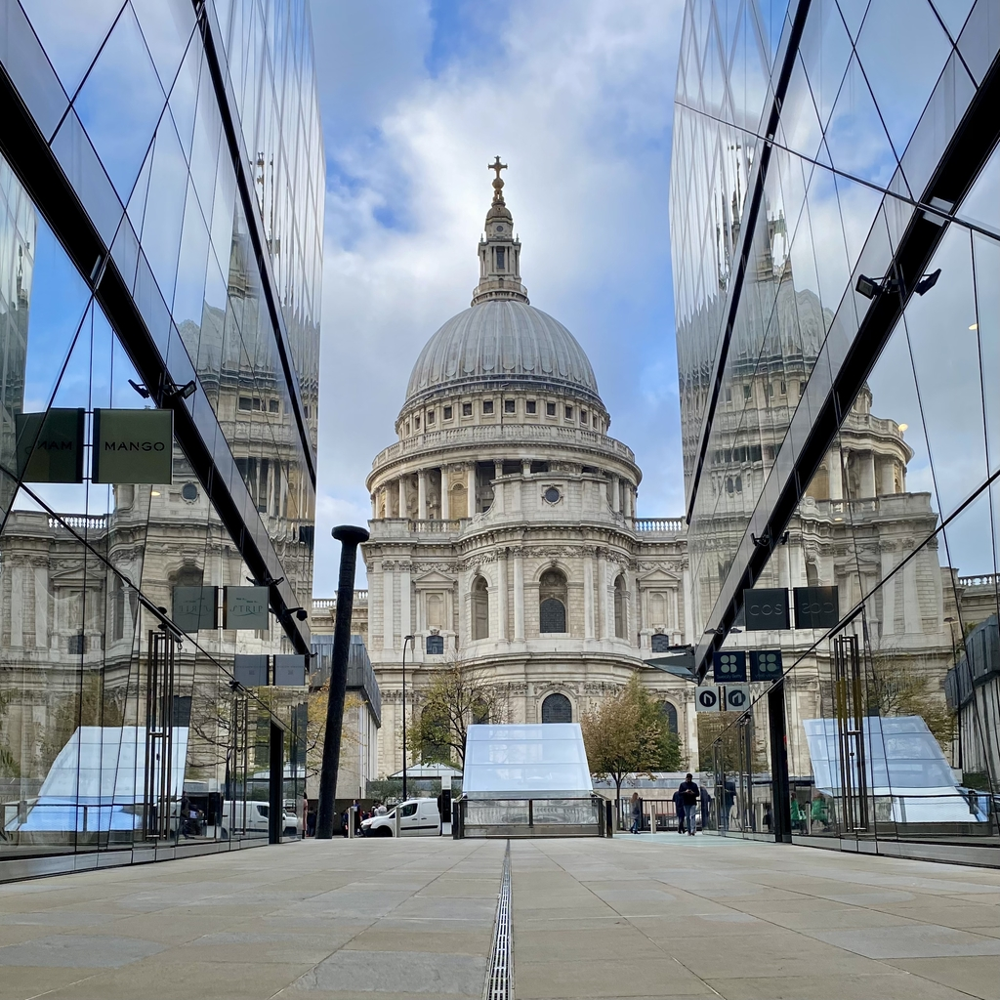
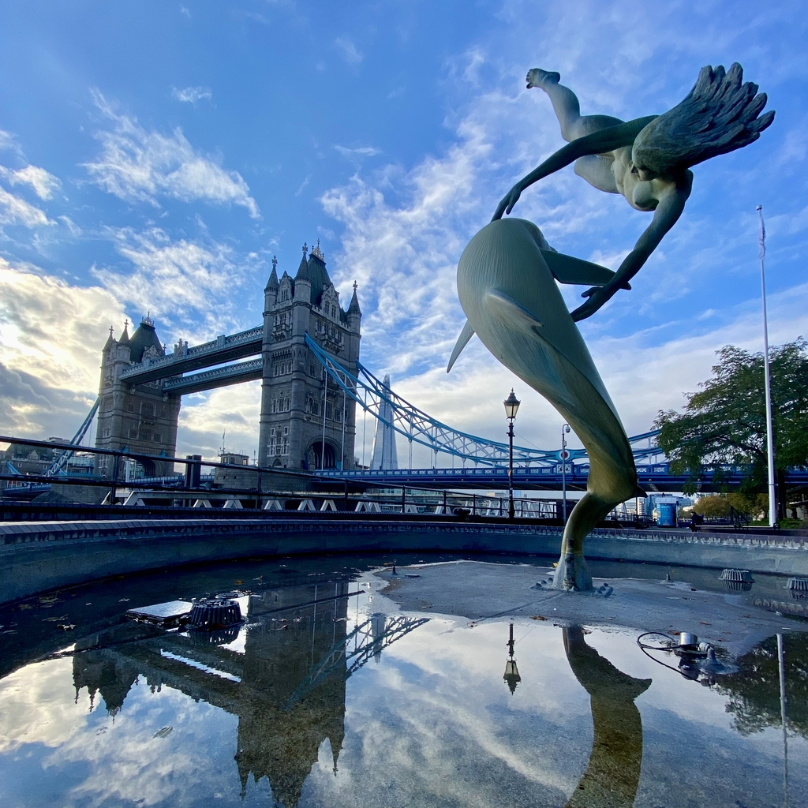
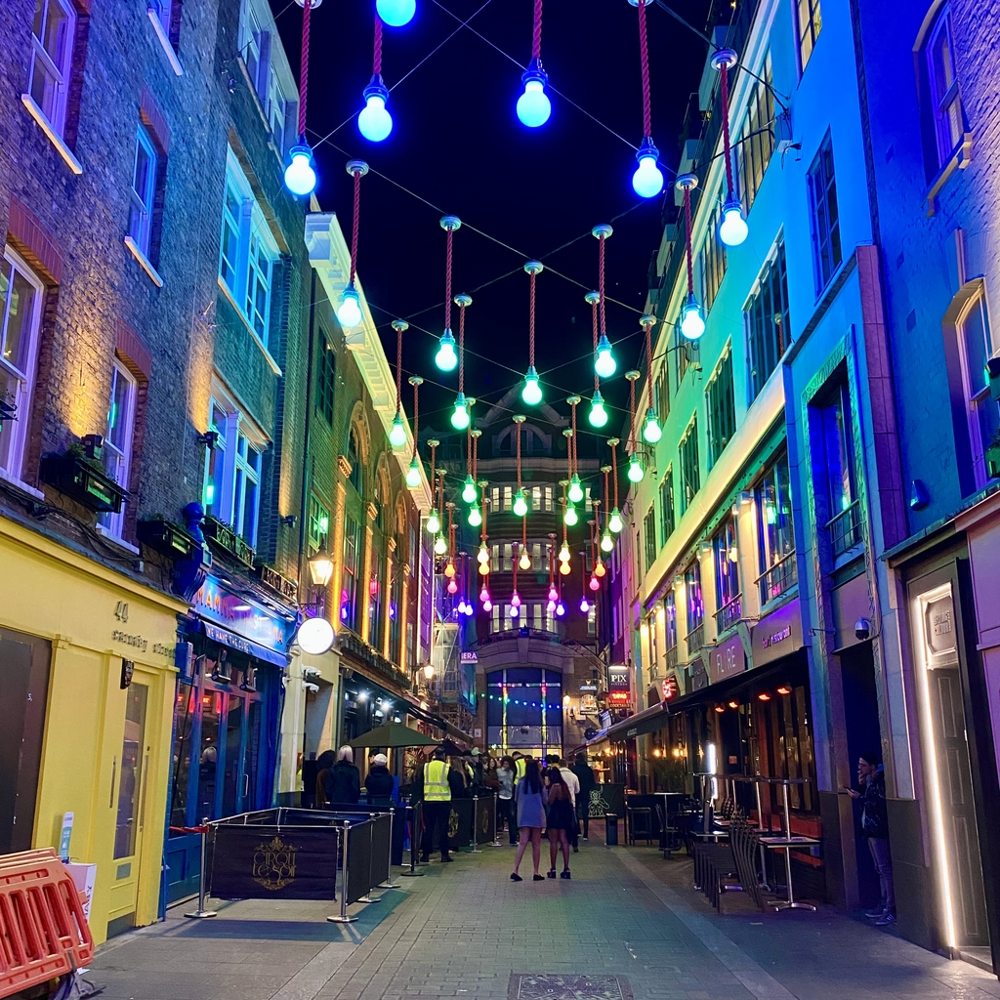

Londra è la capitale e la città più grande dell'Inghilterra e del Regno Unito. È un importante centro culturale, finanziario e politico, con una popolazione diversificata e una ricca storia. È la sede di numerosi luoghi iconici come Buckingham Palace, Big Ben e la Torre di Londra, nonché di musei e gallerie di fama mondiale come il British Museum e la National Gallery. Londra è anche un importante hub globale per gli affari e le finanze e viene considerata una delle città più importanti al mondo.

<!--truncate-->

### Cosa fare
- **London Eye**: è la ruota panoramica più alta d'Europa (135 m) ed è l'attrazione turistica a pagamento più popolare del Regno Unito con oltre 3 milioni di visitatori ogni anno. Offre viste uniche sulla città.

- **Tower Bridge**: Costruito alla fine del XIX secolo, ha due bascule che possono essere sollevate per consentire il passaggio del traffico fluviale mentre i pedoni possono utilizzare la connessione a livello elevato per continuare a utilizzare il ponte anche quando è aperto.

- **The Mall**: è una strada che collega Buckingham Palace e Trafalgar Square. La sua superficie è colorata di rosso per dare l'effetto di un grande tappeto rosso.

- **Elizabeth Tower**: sono rimasto sorpreso quando ho scoperto che il  Big Ben è il soprannome della sola campana mentre la torre originariamente si chiamava Clock Tower, ma è stata ribattezzata Elizabeth Tower nel 2012.

- **St Paul's Cathedral**: è una cattedrale anglicana a Londra. È stato l'edificio più alto di Londra per oltre 200 anni.

- **Camden Market**: una destinazione popolare sia per i turisti che per i locali, Camden Market offre una vasta gamma di bancarelle di street food, così come negozi che vendono abbigliamento, artigianato e altri beni.

### Cosa mangiare
- **Fish and chips** - un piatto classico inglese composto da pesce impanato e fritto, servito con patatine fritte.
- **Roast beef e Yorkshire pudding** - un pasto tradizionale inglese di roast beef servito con un grande pudding cotto al forno gonfio, fatto di farina, uova e latte.
- **Te' pomeridiano** - una tradizione inglese di bere tè accompagnato da stuzzichini e piccola pasticceria. Molti famosi hotel a Londra offrono il servizio di tea pomeridiano.

