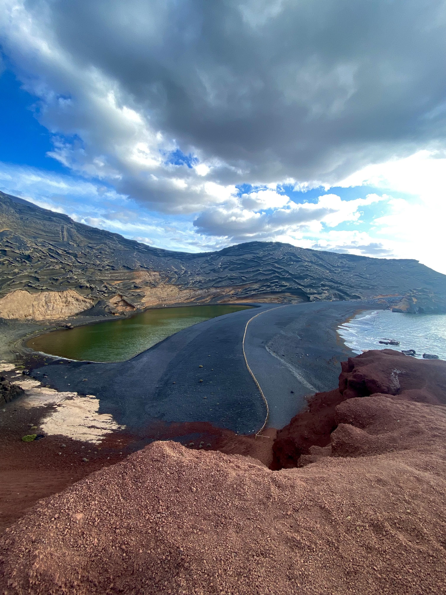
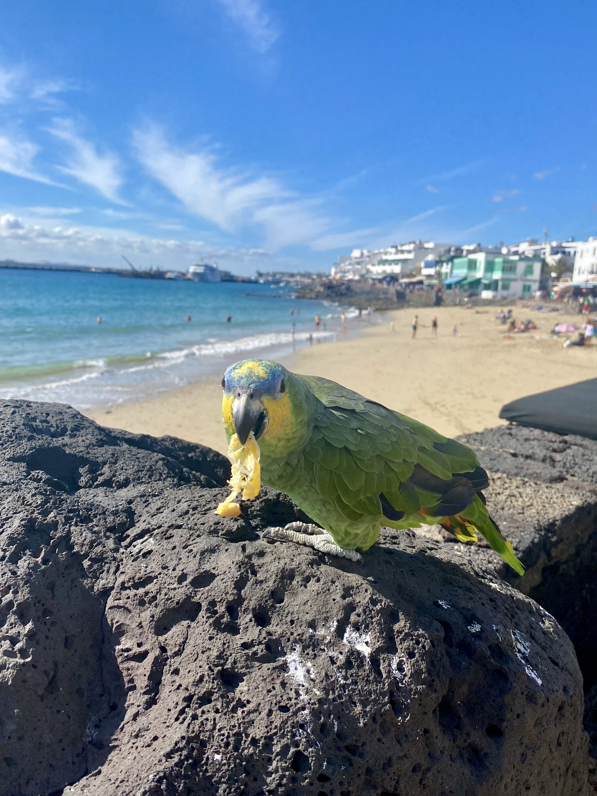
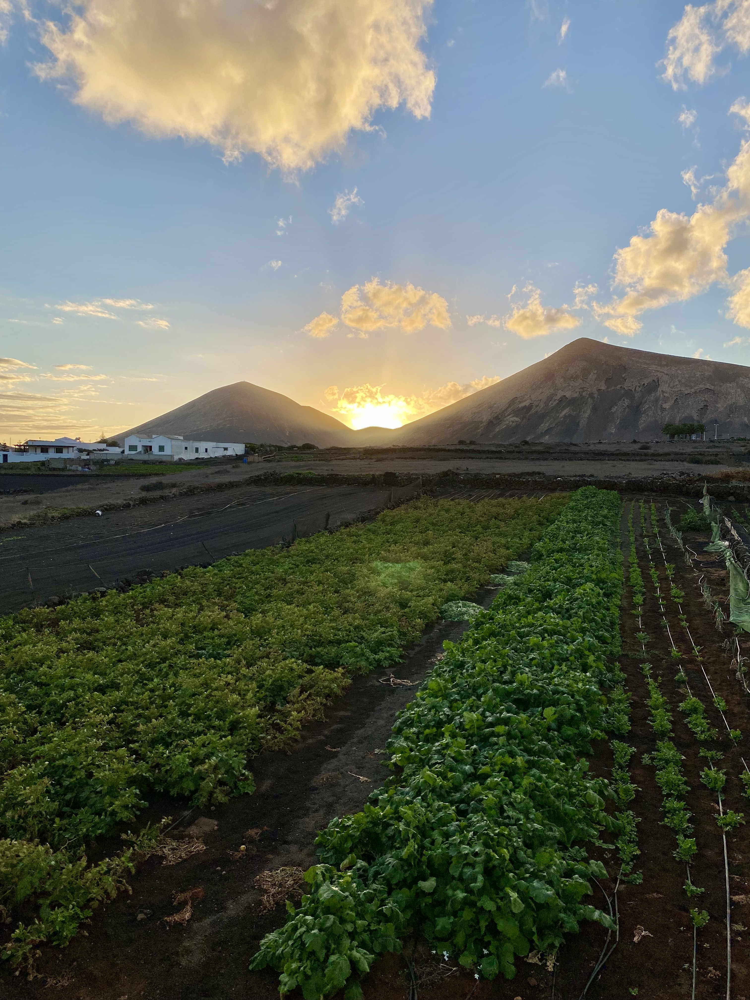

Lanzarote è un'isola spagnola situata nell'Oceano Atlantico al largo della costa africana. Fa parte delle Canarie ed è conosciuta per i suoi paesaggi vulcanici, le spiagge di sabbia bianca e nera e il clima caldo e secco. L'isola è una meta turistica molto popolare per i turisti europei e non solo.

<!--truncate-->

### Cosa fare
- Visita il Parco Nazionale di Timanfaya, che presenta un paesaggio lunare di paesaggi vulcanici e attività geotermiche. Puoi fare un giro in cammello attraverso il parco o partecipare a una visita guidata.

- Vai nella capitale dell'isola, Arrecife, per esplorare il suo affascinante centro storico e visitare il Castillo de San José, un castello trasformato in museo che ospita una collezione d'arte moderna.

- Tuffati nelle acque cristalline in una delle tante spiagge dell'isola, come Playa Blanca o Papagayo.

- Immergiti con le bombole o fai snorkeling per esplorare la vivace vita marina dell'isola, comprese le colorate specie ittiche e le tartarughe marine.

- Fai una gita di un giorno all'isola vicina di Fuerteventura per godere delle sue stupende spiagge e dune di sabbia.

### Cosa mangiare
- Papas arrugadas: piccole patate rugose bollite in acqua salata e servite con una salsa piccante di mojo.

- Sancocho canario: uno stufato rustico a base di pesce, patate e verdure.

- Gofio: una farina tostata ottenuta dai cereali tostati, spesso mescolata con acqua o latte per fare una polenta o utilizzata come ingrediente in altri piatti.

- Queso de cabra: formaggio di capra prodotto sull'isola e spesso servito come tapa (piccolo antipasto).

- Mojo verde: una salsa a base di prezzemolo, aglio, olio e aceto, spesso servita con carne alla griglia o papas arrugadas.

