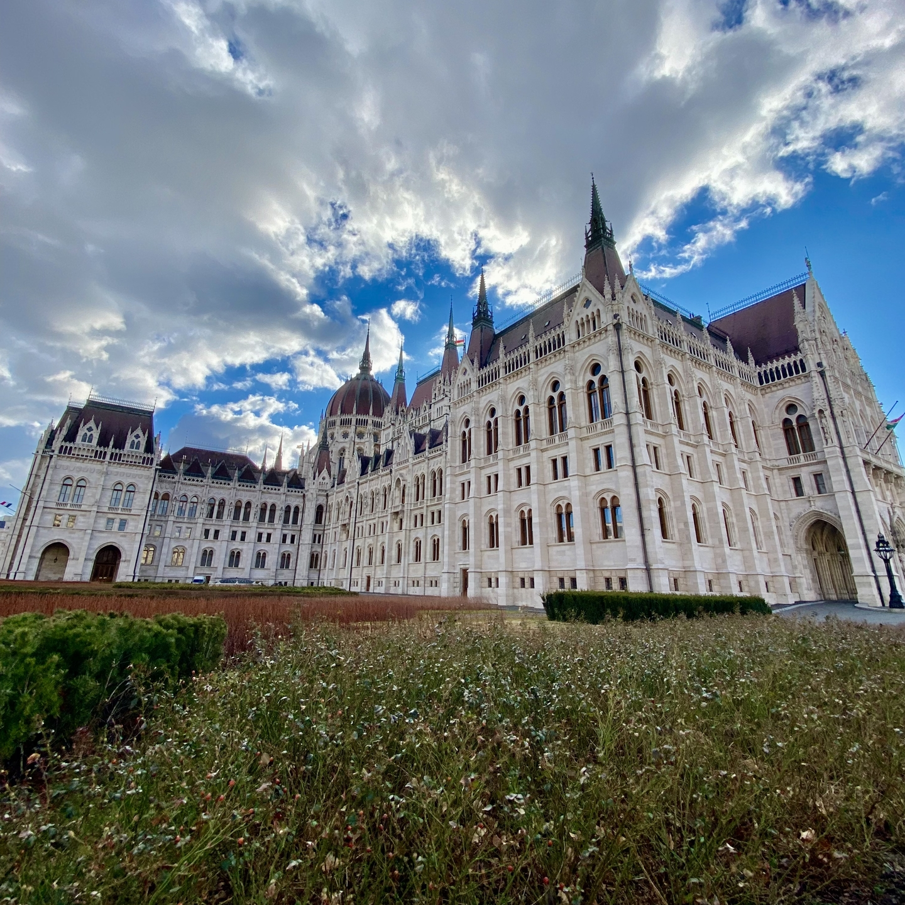
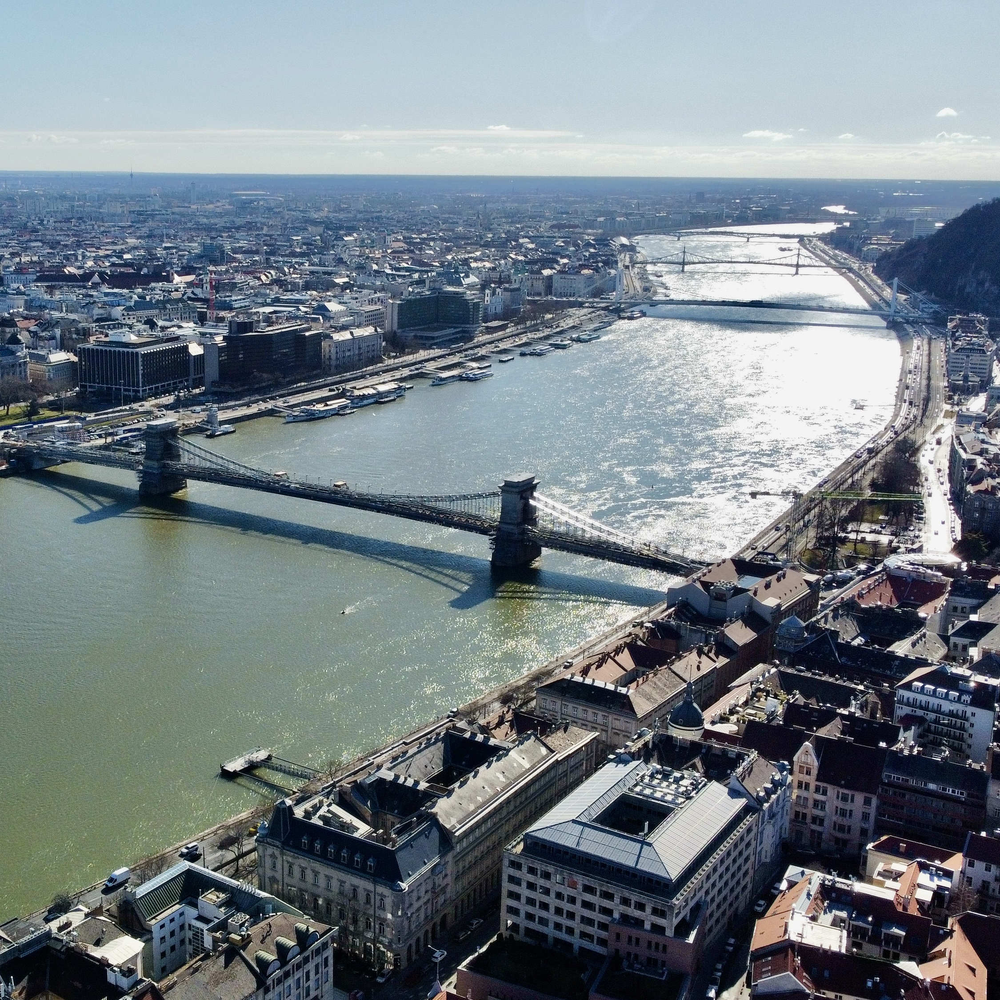
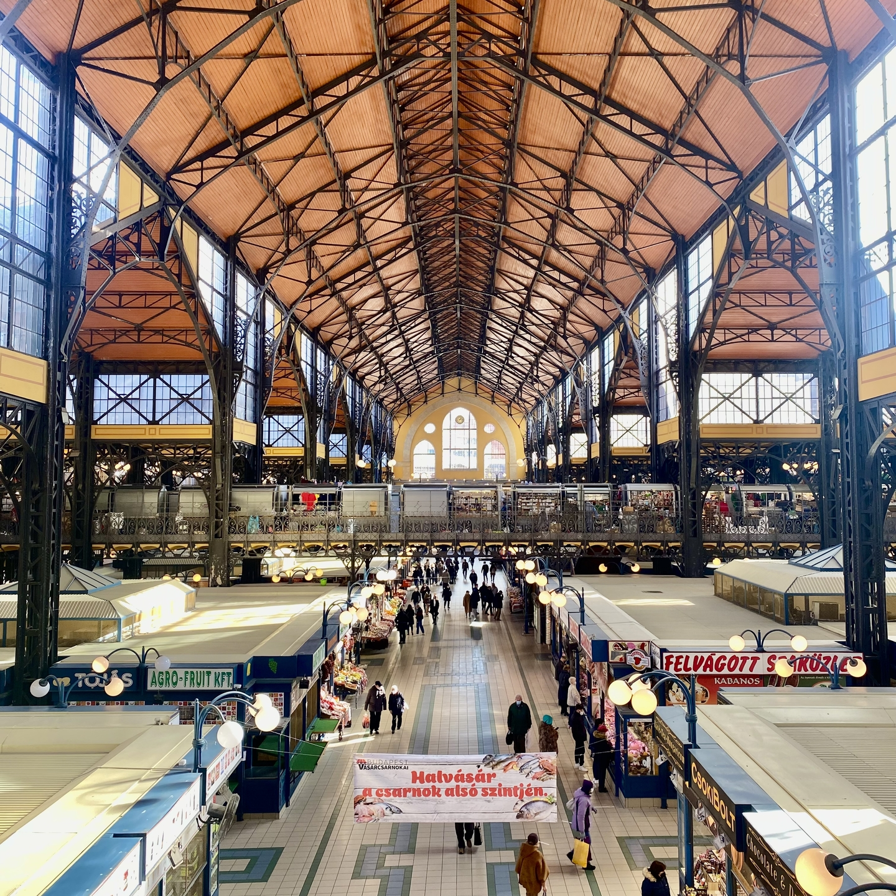

Capitale dell’Ungheria e posizionata in mezzo al paese.
E’ stata fondata unendo due città chiamate Buda e Pest.
Il Danubio taglia la città a meta’ dividendo le due vecchie città.
Buda, posizionata nella parte ovest del Danubio, e’ la parte storica della città di Budapest mentre Pest, ad est della città e’ la parte più commerciale e amministrativa.

<!--truncate-->

### Cosa fare
- Visita il Parlamento ungherese: proprio accanto al Danubio c'è questo imponente edificio bianco. Vale la pena dare un'occhiata da vicino durante il giorno e dalla sponda opposta del Danubio durante la notte, quando viene illuminato con una luce blu molto suggestiva.
- Rilassati in uno dei bagni termali della città: il sottosuolo di Budapest è ricco di sorgenti termali naturali e gli ungheresi ne hanno tratto vantaggio costruendo diversi bagni termali, il più famoso dei quali è quello di Széchenyi, con diverse vasche all'interno di un palazzo storico e alcune vasche esterne per un'esperienza rinfrescante, specialmente in inverno quando la differenza di temperatura tra l'acqua e l'esterno può superare i 30 gradi.
- Esplora il Bastione dei Pescatori: il logo dei film di Walt Disney, solo più bello e antico. Offre una vista mozzafiato sulla città ed è assolutamente da vedere.
- Rifletti guardando le Scarpe sul lungofiume del Danubio: situato vicino al Parlamento, è un monumento commemorativo per ricordare gli ebrei a cui veniva chiesto di togliersi le scarpe e che venivano poi uccisi sul bordo del flume in modo che i loro corpi venissero portati via dalla corrente. Il monumento rappresenta le loro scarpe lasciate sulla riva.
- Dai un'occhiata ai bar in rovina: bar unici costruiti in edifici abbandonati e decorati con opere d'arte eclettiche, che creano un'atmosfera vibrante e internazionale. Sono un labirinto e sono rimasto sorpreso da quanto piccoli sembrino dall'esterno.
- Vai al Mercato centrale: Una struttura di due piani dove si possono trovare diversi ingredienti e piatti della tradizione locale.

### Cosa mangiare
- Gulasch: Uno stufato preparato con carne di manzo, patate, carote, paprika e altre spezie, il classico piatto ungherese.
- Langos: Questa pizza fritta è un popolare cibo da strada a Budapest, di solito guarnito con panna acida, formaggio e aglio.

