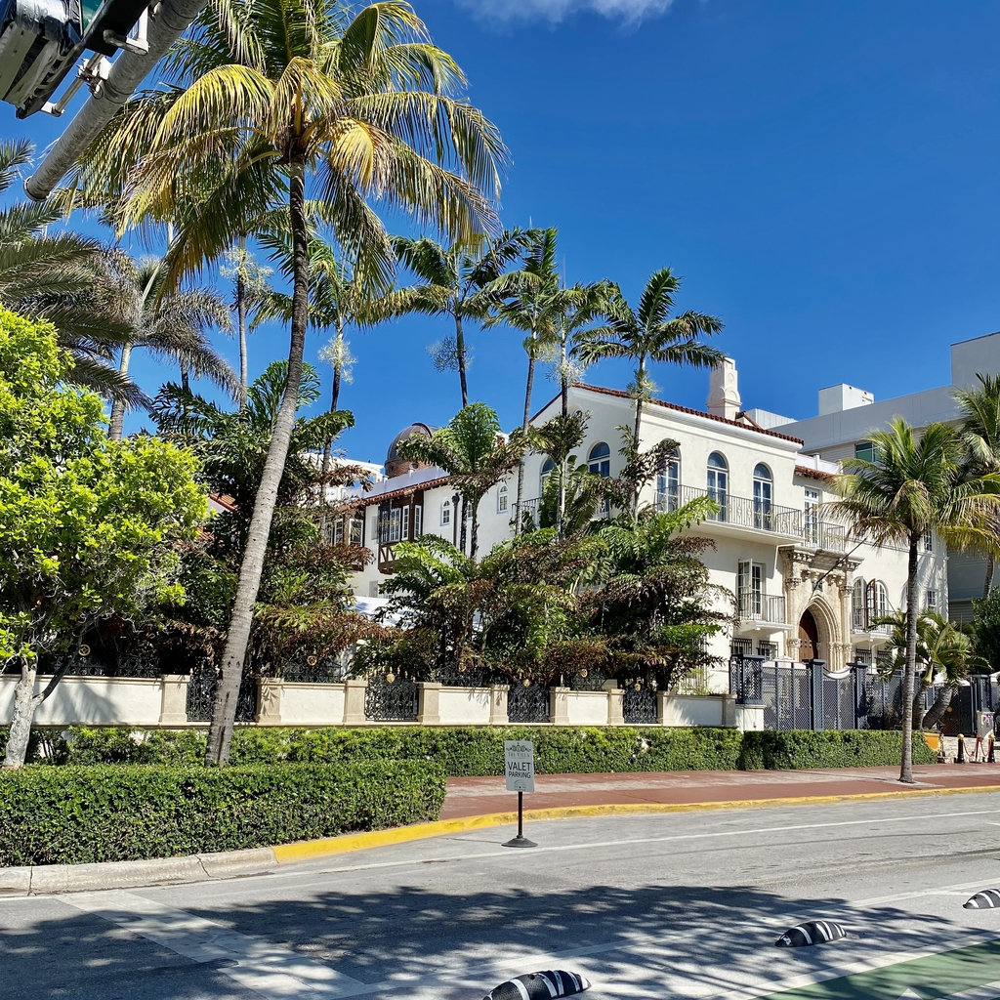

Miami è una città situata nella parte sud-orientale della Florida negli Stati Uniti. È conosciuta per le sue bellissime spiagge, la vivace vita notturna e la cultura diversa. È anche un importante centro per il finanziamento, il commercio e l'intrattenimento della regione.

<!--truncate-->

### Cosa fare
- Esplora Miami Beach: Miami è sede di alcune delle spiagge più belle del mondo, le più famose si trovano a South Beach, circondate da edifici alti con lunghe spiagge e torri dei bagnini colorate.

- Visita Little Havana: un [quartiere](https://goo.gl/maps/sQYiAEAcbixdBhNk6) che ospita una grande popolazione di immigranti cubani e loro discendenti. È conosciuto per il suo clima vivace, l'arte di strada colorata e il delizioso cibo cubano.

- Visita il mercato di [Bayside](https://goo.gl/maps/8WZ5JXpTXnPG22Bd6): Un complesso di negozi e intrattenimento situato nel centro di Miami, in Florida. Si trova lungo la baia di Biscayne e offre una varietà di negozi di articoli di consumo, ristoranti e caffè. Il complesso è diviso in due livelli, con il livello superiore che offre una zona di shopping all'aperto e il livello inferiore che ospita una zona food court e intrattenimento dal vivo.
  
- Prendi una barca: puoi trovare diversi tour giornalieri che partono da Bayside Marketplace che ti permettono di vedere Miami da un altro punto di vista mentre vedi le ville delle celebrità.

- Serata a [Ocean Drive](https://goo.gl/maps/S1nUxcbu2cCzXobA6): una strada popolare e destinazione turistica, con milioni di visitatori ogni anno che vengono a godere dell'atmosfera vivace e a prendere il sole sulla spiaggia. La sera, Ocean Drive si anima con musica e folle di persone che godono della vita notturna.

- Night out at [Ocean Drive](https://goo.gl/maps/S1nUxcbu2cCzXobA6): A popular street and tourist destination, with millions of visitors each year coming to experience the lively atmosphere and soak up the sun on the beach. In the evening, Ocean Drive comes alive with music and crowds of people enjoying the nightlife.

### Cosa mangiare
- Gelato di [Azucar](https://goo.gl/maps/ANoKaXgrTjqxjCfk8): Sembra strano lo so detto da un Italiano, ma sono rimasto piacevolmente stupito dal sapore di questo gelato, tanti gusti particolari che ti consiglio assolutamente di provare.

- Granchi di pietra: Miami è conosciuta per i suoi deliziosi granchi di pietra, che vengono pescati nelle acque della costa della Florida e serviti freddi con salsa di senape. Sono di solito di stagione da ottobre a maggio.

- Torta al lime: la torta al lime è una delle prelibatezze della Florida e Miami è il posto perfetto per provarla. Questo dolce è fatto con una base di biscotto al burro, un ripieno di latte condensato zuccherato e succo di lime e una copertura di panna montata.

- Ceviche: il ceviche è un popolare piatto di pesce crudo o frutti di mare "cotto" in succo di agrumi e condito con erbe e spezie. È un'opzione rinfrescante e leggera perfetta per una calda giornata a Miami.

- Empanadas: le empanadas sono paste salate ripiene di una varietà di ripieni, come carne, verdure o formaggio. Sono uno spuntino popolare a Miami e possono essere trovate in molti panifici e food truck locali.

