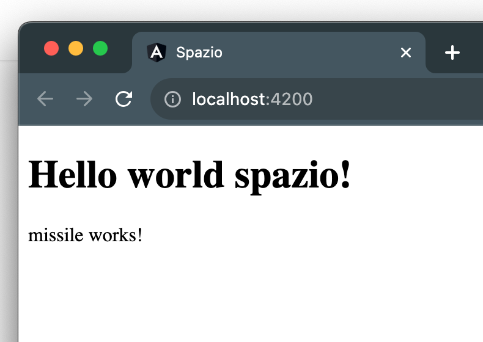

# Data binding

Abbiamo visto come l'HTML utilizzato nel file di template venga caricato nel browser quando instanziamo un nuovo componente attraverso il selettore.

Mentre abbiamo visto che, attraverso il file Typescript definiamo una classe che rappresenta la funzionalita' del componente.

Prendiamo come esempio il componente `App`, nel suo file Typescript troviamo:
```ts title="app.component.ts"
export class AppComponent {
  title = 'spazio';
}
```

il `title` e' quindi definita all'interno della classe `AppComponent` come una proprietà.

come si utilizza questa proprietà all'interno del template `app.component.html`?

possiamo accedere ad ogni proprietà tramite un meccanismo di Angular chiamato data binding, qui troviamo la prima diffenenza di sintassi tra un documento HTML ed un file di template di Angular; Utilizzando la sintassi `{{🐧NOME_PROPRIETÀ🐧}}` siamo in grado di attingere dalla classe per qualsiasi proprieta' vogliamo.

Possiamo utilizzare questa sintassi ovunque all'interno della struttura HTML, all'esterno:

```html
<h3> Lista dei desideri: </h3>
{{title}}
<ul>
  <li> Vorrei un pinguino <li>
</ul>
```
ma anche all'interno di tag:

```html
<h3> Lista dei desideri: </h3>
<ul>
  <li> Vorrei un pinguino {{title}} <li>
</ul>
```

Proviamo ora ad utilizzare data binding nel titolo della nostra app:

```diff title="app.component.html"
- <h1>Hello world Angular!</h1>
+ <h1>Hello world {{title}}!</h1>
```

Il browser carichera' ora il risultato finale:



Ora una piccola task cambiamo `title` in `titolo`. Le modifiche da fare sono in due file, ed il risultato finale nel browser non dovrebbe cambiare.

:::info
Confuso? trovi [qui](https://github.com/lucatardi/spazio/commit/ac7b178539748aa1ceee67bbf007c15095bf2db9?diff=split) il codice cambiato in questa lezione.
:::

