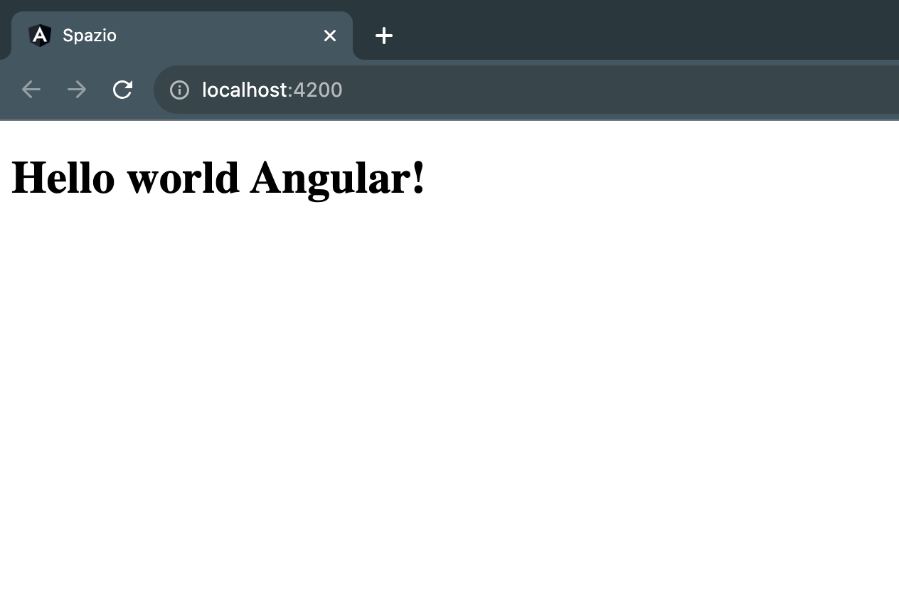

# Hello world Angular

Tramile la CLI di Angular eseguiamo ora il comando `ng serve` in modo da poter lanciare l'applicazione nel localhost del nostro computer.
Questo comando fara' partire un server locale che verra' utilizzato per caricare la nostra applicazione all'indirizzo [http://localhost:4200/](http://localhost:4200/).

La schermata che ci viene presentata e' del contenuto che Angular CLI ha creato per noi all'interno della nostra applicazione. Questo codice si trova infatti nel file `app.component.html`.

Apriamo il file e cancelliamo il contenuto delimitato dai commenti, mantenendo il resto.

Osservando il nome del file vediamo che e' un file di estensione HTML, proviamo quindi ad incollare nella prima riga del file un semplice tag HTML:

```html
<h1>Hello world Angular!</h1>
```
Ora salviamo il file e controlliamo il browser che dovrebbe ora riflettere il contenuto che abbiamo appena inserito e eliminato tutto il resto.




:::info
Puoi trovare [qui](https://github.com/lucatardi/spazio/commit/06ad041ef6aadfe05a1f41df48ce33f3e9061b28) il codice cambiato in questa lezione.
:::