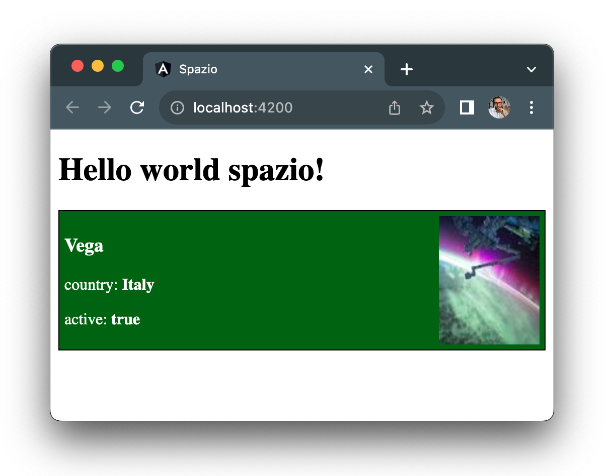
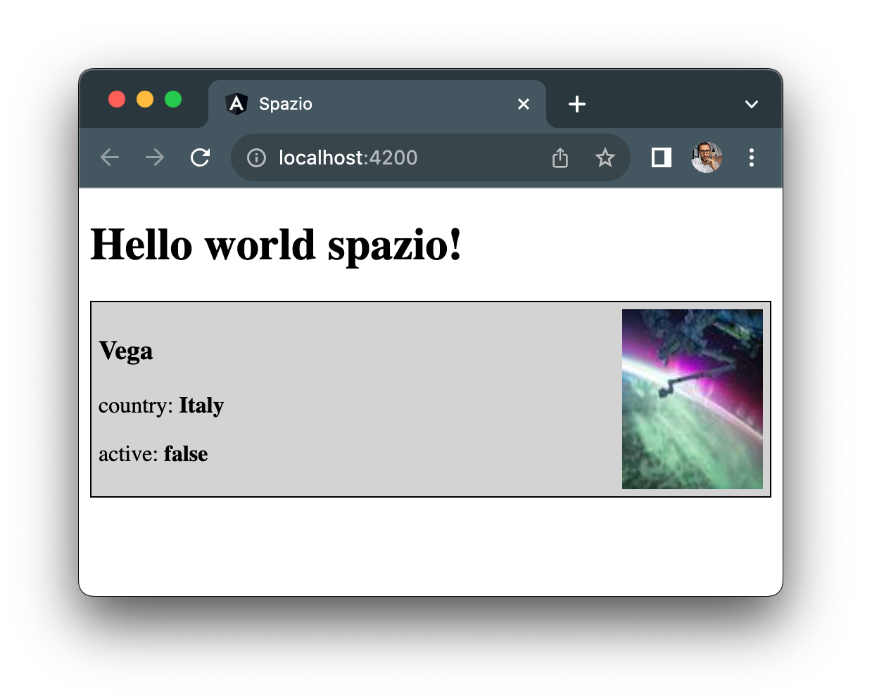

# Stilizzare un componente

Stilizzare un componente in Angular avviene attraverso la scrittura di CSS nel file di style del componente proprio come si farebbe per un qualsiasi file css collegato ad un file html. La forza di Angular e' l'incapsulamento automatico dello stile, infatti tutto il CSS all'interno di un componente non viene applicato all'esterno di esso.
Questo ci evita di dovere essere specifici nei selettori nei nostri componenti o di avere CSS di altri componenti applicato al nostro nuovo componente.

Aggiungiamo come selettore la classe `card` al div esterno del componente missile:

```diff title="missile.component.html"
- <div>
+ <div class="card">
  <h3>{{missile.name}}</h3>
```

e poi nel css del componente missile targatizziamo la classe `card`:

```css title="missile.component.css"
.card {
  border: 1px solid black;
  padding: 5px;
}
```

In questo modo saremmo in grado di vedere un bordo nero del componente missile. ora se hai già lavorato con css noterai che la scelta del nome molto generico `card` del selettore potrebbe portare a problemi ad esempio molto probabilmente un altro sviluppatore potrebbe decidere in qualunque altro componente di utilizzare lo stesso selettore `card` per un altro set di stile ma se questo accade il nostro bordo non verra' comunque applicato grazie al meccanismo di incapsulamento dello stile di Angular.

Angular ci aiuta ancora di più quando vogliamo applicare css in maniera dinamica. Mettiamo il caso che volessimo rendere ancora piu' visibile lo stato del missile, applicando un background verde quando il missile e' ancora attivo mentre un background grigio quando e' disattivo.

Aggiungiamo allo stile di seguito al selettore della classe `card` due nuovi selettori `active` e `inactive`:

```css title="missile.component.css"
.active {
  background-color: darkgreen;
  color: white;
}

.inactive {
  background-color: lightgray;
  color: black;
}
```

Ora spostiamoci nel file del template dove abbiamo il valore `missile.active` e vogliamo applicare la classe `active` o la classe `inactive` a seconda del valore `true` o `false` di quella proprieta'. Come?

All'interno del property binding di Angular noi possiamo eseguire del codice javascript. In questo caso con l'operatore ternario possiamo ritornare la corretta classe:

```diff title="missile.component.html"
- <div class="card">
+ <div class="card {{missile.active ? 'active' : 'inactive' }}">
  <h3>{{missile.name}}</h3>
```

Quando Angular compilera' questa nuova linea di codice fara' i seguenti step:
1. In questa riga di codice c'e' un simbolo di property binding `{{ }}`?
2. Si quindi risolvo quello prima:
3. `missile.active ? 'active' : 'inactive'` il missile e' attivo quindi il risultato di questo operatore ternario e' la stringa `'active'`.
4. Sostituisco il risultato e continuo nella normale lettura del HTML, ottentendo questo risultato finale: `<div class="card active">`.


Infine aggiustiamo un pò il layout del componente aggiugendo un immagine e applicando flexbox di base per renderlo leggermente piu' gradevole:

```diff title="missile.component.html"
+  <div>
    <h3>{{missile.name}}</h3>
    <p>country: <b>{{missile.country}}</b></p>
    <p>active: <b>{{missile.active}}</b></p>
+  </div>
+  
```

```diff title="missile.component.css"
.card {
  border: 1px solid black;
  padding: 5px;
+  display: flex;
+  justify-content: space-between;
}
```

Il risultato nel browser dovrebbe essere il seguente:



Modificando la proprieta' `active` da `true` a `false` e viceversa dovresti vedere il colore cambiare:

