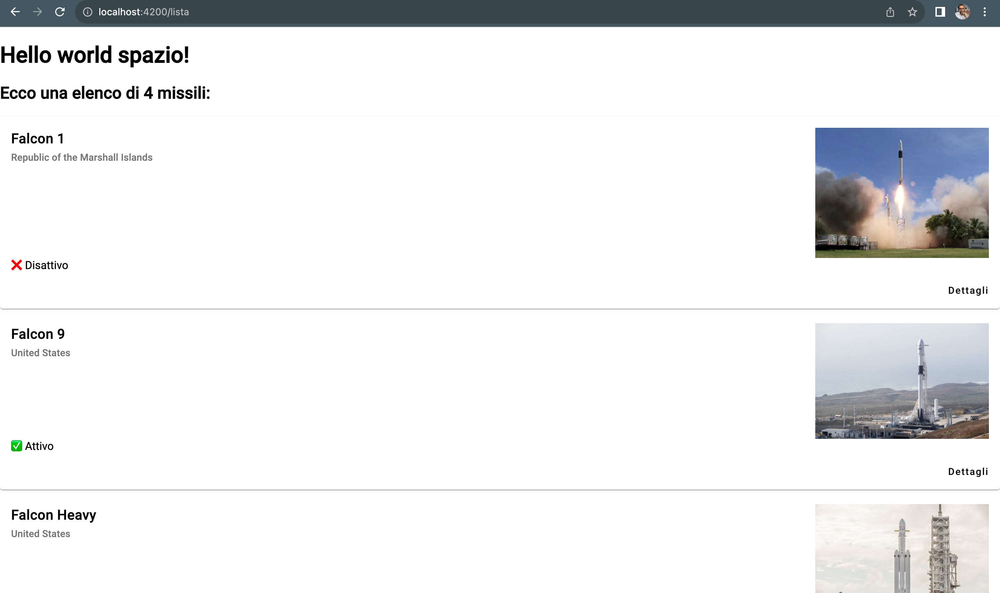

# Il motivo del progetto

Credo fermamente che imparare qualsiasi cosa sia piu' facile quando si combina al concetto teorico anche l'atto pratico. Per questo motivo tutti gli aspetti teorici di questo corso verranno accompagnati da un esempio pratico.

# Il progetto

L'idea e' quella di sviluppare un'interfaccia in grado di mostrare gli ultimi missili spaziali nell'archivio di SpaceX. inizieremo con il popolamento dei dati in modo manuale per poi chiamare dalla nostra UI le API di SpaceX per ottenere valori reali.

La UI conterra' una pagina principale dove verra mostrata all'utente una lista dei missili, mostrando il nome, il paese di costruzione, l'immagine e lo stato.

Ogni elemento della lista avra' un link che portera' ad una pagina di dettaglio con tutte le informazioni ad esso relative.

Infine connetteremo il nostro progetto con una API di SpaceX in modo da avere informazioni reali e alla data odierna.

Qui possiamo vedere il risultato finale del progetto:

