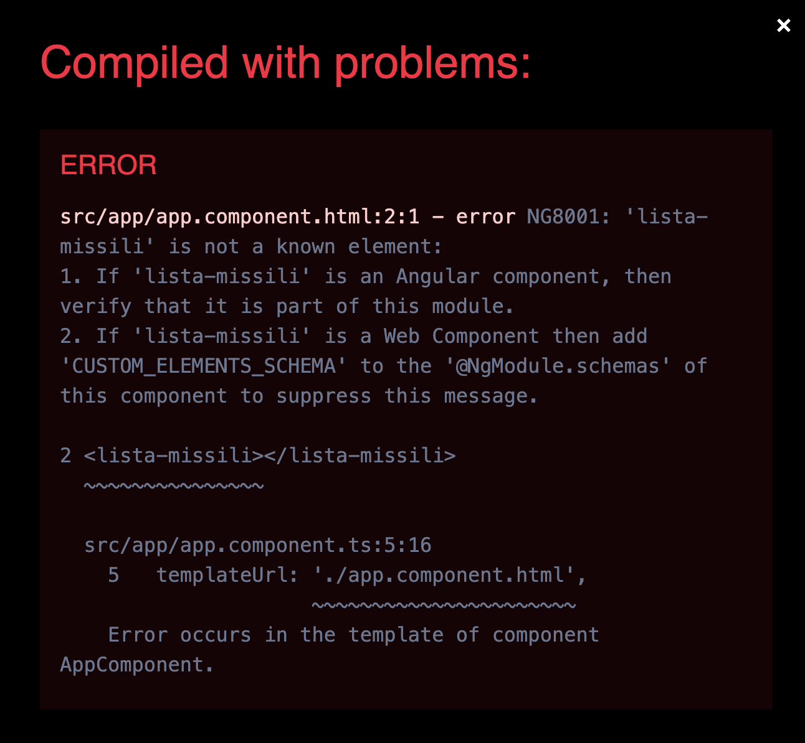
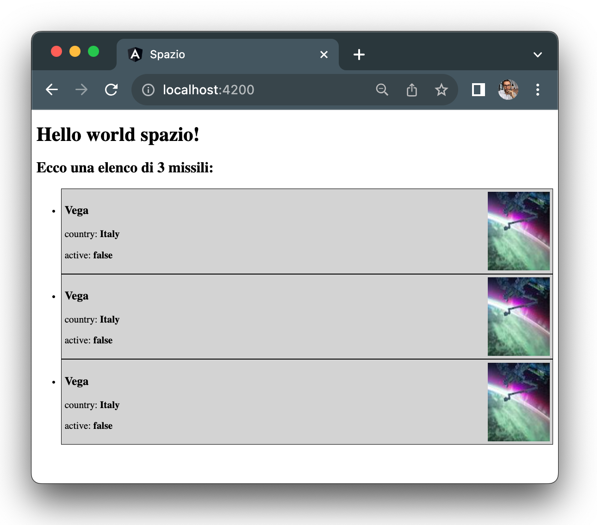
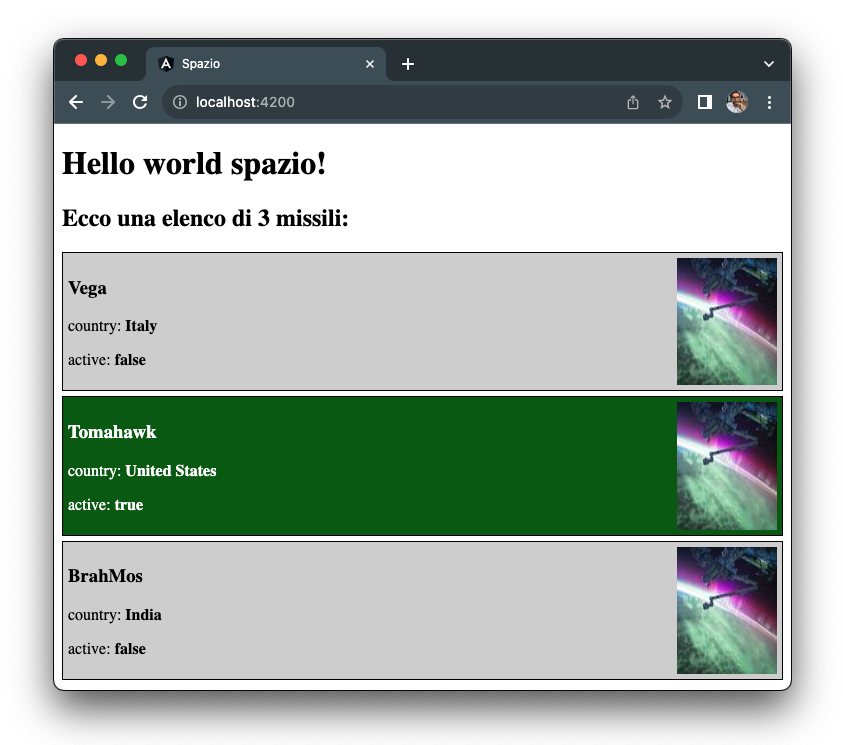

# Una lista di missili

Ora che abbiamo il componente missile possiamo riutilizzarlo per rappresentara quanti missili vogliamo.

Creiamo un componente tramite Angular CLI chiamato `lista-missili` che conterrà tutti i missili che vogliamo mostrare all'utente:

```shell
ng generate component lista-missili
```

All'interno della cartella creata dalla CLI andiamo ad inserire il template del nuovo componente:

```html title="lista-missili.component.html"
<h2>Ecco una elenco di 3 missili</h2>
<ul>
  <li>
    <missile></missile>
  </li>
  <li>
    <missile></missile>
  </li>
  <li>
    <missile></missile>
  </li>
</ul>
```

Come vediamo la lista dei missili avra' un titolo e una lista non ordinata di tre missili all'interno di `<li>`.

Andiamo ora nel file `app.component.html` per apportare una modifica: vogliamo ora caricare il componente `lista-missili` e non piu' il singolo `missile` che abbiamo li, sara' poi il componente `lista-missili` responsabile di caricare i tre componenti `missile` al suo interno:

```diff title="app.component.html"
<h1>Hello world {{titolo}}!</h1>
- <missile></missile>
+ <lista-missili></lista-missili>
<router-outlet></router-outlet>
```

Controlliamo ora il risultato nel browser e 💥...



Come mai non riusciamo a vedere piu' l'applicazione e compare questo errore nel nostro browser? Il primo passo per un buon trouble shooting di un problema e' leggere gli indizi che ci vengono presentati:

Prima di tutto l'errore menziona il fatto che `lista-missili` non e' un componente riconosciuto da Angular per poi mostrare che il problema appare quando utilizziamo `<lista-missili>` all'interno del template.

Ci siamo dimenticati qualcosa? Si.. quando creiamo un componente con la CLI il nome che viene assegnato al selettore e' `app-🐧NOME_COMPONENTE🐧`.
Quando abbiamo creato il componente `missile` abbiamo modificato il selettore ma nel caso del componente `lista-missili` non lo abbiamo fatto, il che vuol dire che Angular non capisce coda noi intendiamo per `<lista-missili>` dato che il componente che conosce e' `<app-lista-missili>`.
per risolvere queto problema dobbiamo apportare una semplice modifica nella definizione del componente `lista-missili`:

```diff title="lista-missili.component.ts"
@Component({
- selector: 'app-lista-missili',
+ selector: 'lista-missili',
  templateUrl: './lista-missili.component.html',
  styleUrls: ['./lista-missili.component.css']
})
```

L'errore dovrebbe essere risolto e il browser dovrebbe caricare la seguente interfaccia:



Osservando la pagina possiamo notare due cose da sistemare:
- Dobbiamo stilizzare la lista per renderla un po piu' appagante all'occhio.
- Abbiamo una lista di tre missili che sono copie, dobbiamo estendere la lista in modo da avere missili diversi tra loro.

Iniziando con il primo punto possiamo assegnare una classe `list` alla lista:
```diff title="lista-missili.component.html"
<h2>Ecco una elenco di 3 missili</h2>
- <ul>
+ <ul class="list">
```

Per poi aggiungere un po' di stile nel corrispettivo file:

```css title="lista-missili.component.css"
.list {
  list-style-type: none;
  padding: 0;
  margin: 0;
  display: flex;
  flex-direction: column;
  gap: 5px;
}
```

Ora che lo stile del nostro componente e' sistemato occupiamoci del secondo punto:

Al momento le informazioni di un missile sono contenute della definizione del componente missile. Quello che dobbiamo fare e' accettare nel componenete missile queste informazioni dalla lista. Iniziamo ad aggiungere alla lista un array contenente tre missili:

```ts title="lista-missile.component.ts"
export class ListaMissiliComponent {
   missili: Missile[] = [
    {
     name: 'Vega',
     country: 'Italy',
     active: false
    },
    {
      name: 'Tomahawk',
      country: 'United States',
      active: true
    },
    {
      name: 'BrahMos',
      country: 'India',
      active: false
    },
   ]
}
```

ora abbiamo a disposizione questo array di `missili` da utilizzare nel template del componente `lista-missili`. Ma come facciamo a passare l'informazione al componente `missile`?

Possiamo utilizzare un meccanismo simile al property binding, infatti possiamo passare informazioni da un componente padre, nel nostro caso `lista-missile` ad un componente figlio (`missile`) tramite questa sintassi:

```html
<nome-componente [nome-proprietà]="valore-proprietà">
```

all'interno del `nome-componente` abbiamo quindi accesso al `valore-proprietà` attraverso una proprietà chiamata `nome-proprietà` che attua da input per `nome-componente`.

All'interno del template del `lista-missili` proviamo a passare missili diversi come proprieta' per il componenti figlio:

```diff "lista-missili.component.html"
<li>
-  <missile></missile>
+  <missile [missile]="missili[0]"></missile>
</li>
<li>
-  <missile></missile>
+  <missile [missile]="missili[1]"></missile>
</li>
<li>
-  <missile></missile>
+  <missile [missile]="missili[2]"></missile>
</li>
```

Ora dobbiamo istruire il componente `missile` ad accettare la nuova proprieta' `[missile]` per fare cio' modifichiamo la definizione del componente `missile` utilizzando il decoratore `Input` che troviamo in Angular proprio come abbiamo importato il decoratore `Component`:

```diff title="missile.component.ts"
- import { Component } from '@angular/core';
+ import { Component, Input } from '@angular/core';
import { Missile } from './missile';

@Component({
  selector: 'missile',
  templateUrl: './missile.component.html',
  styleUrls: ['./missile.component.css']
})
export class MissileComponent {
-  missile: Missile = {
-    name: 'Vega',
-    country: 'Italy',
-    active: true
-  };
+ @Input() missile: Missile = { name: '', country: '', active: false}; 
}
```
Ricapitoliamo cosa abbiamo cambiato:

1. Abbiamo importato il decorate `Input` da Angular.
2. Abbiamo rimosso l'oggetto statico `missile` che avevamo assegnato all'interno del componente.
3. Tramite il decoratore `@Input()` abbiamo definito `missile` come una proprieta' accettata al di fuori dal componente del tipo Missile con un valore di default.

Ora nel browser dovremmo vedere la giusta rappresentazione della lista con i tre missili:



:::info
Ti sei perso nei passaggi di questa lezione? Controlla [qui](https://github.com/lucatardi/spazio/commit/6666649eed09f155f2043d8343f4ff865c8692f1?diff=split) il codice.
:::


