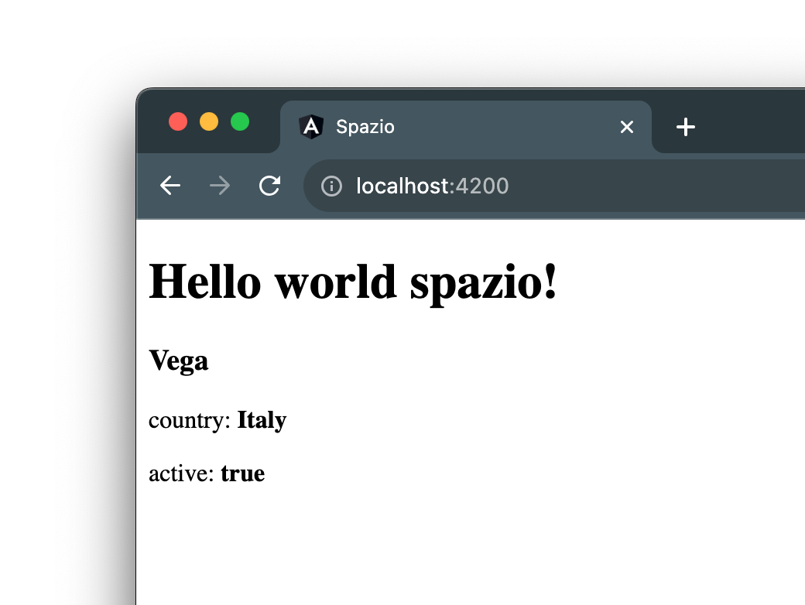

# Il tipo Missile

Iniziamo ad arricchire il nostro componente missile, nella sua definizione nel file `missile.component.ts` aggiungiamo una proprietà chiamata missile.

Come rappresentiamo un missile?

Le informazioni che un missile deve avere sono le seguenti:

- **name**: una stringa che rappresenta il nome del missile.
- **country**: una stringa che rappresenta il paese d'origine del missile
- **active**: un boolean che esprime se il missile e' attivo o meno.

Creiamo un tipo `Missile` per descrivere queste tre proprietà, in tre step:

1. Creiamo un file nella cartella `missile` chiamato `missile.ts`. Sarà il file contenente tutti i tipi che ci serviranno per il componente missile.
2. Definiamo il tipo `Missile`
3. Esportiamo il tipo appena creato in modo da poterlo utilizzare in altri file.

```ts title="missile.ts"
export type Missile = {
  name: string;
  country: string;
  active: boolean;
}
```

Ora che abbiamo il tipo Missile disponibile importiamo nel nostro file `missile.component.ts` e utilizziamo come tipo per la proprietà creata precedentemente assegnando poi alcuni valori:

```ts title="missile.component.ts"
export class MissileComponent {
  missile: Missile = {
    name: 'Vega',
    country: 'Italy',
    active: true
  };
}
```

Ora spostiamoci nel template e creiamo una semplice struttura html per visualizzare i dati che abbiamo inserito nella definizione del componente:

```html title="missile.component.html"
<div>
  <h3>{{missile.name}}</h3>
  <p>country: <b>{{missile.country}}</b></p>
  <p>active: <b>{{missile.active}}</b></p>
</div>
```

Come vedete dobbiamo prima accedere la proprieta' missile e poi il suo contenuto.

Il risultato nel browser sarà il seguente:




   
:::info
Trovi [qui](https://github.com/lucatardi/spazio/commit/1f798725fd8eb2eff80a2a09220408c4ccd9ed22?diff=split) le modifiche apportate in questa lezione.
:::